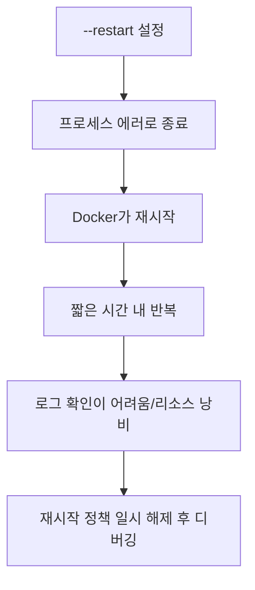

# Deep Dive - 트러블슈팅

## 시나리오 1: 컨테이너가 "바로 종료"된다 (`Exited (0)` 또는 `Exited (1)`)

### 트러블슈팅 흐름도

```mermaid
flowchart LR
  A[docker run] --> B[컨테이너 생성]
  B --> C[PID 1 실행]
  C -->|정상 종료| D[Exited (0)]
  C -->|에러 종료| E[Exited (1..)]
  D --> F[요구사항 확인: 데몬이 필요한가?]
  E --> G[logs/inspect로 원인 분석]
```

### 시나리오 설명

<details>
<summary>문제 상황 보기</summary>

- 증상:
  - `docker ps`에는 안 보이고 `docker ps -a`에 `Exited`로만 남는다.
  - `-d`(detach)로 실행했는데도 바로 내려간다.
- 환경: `docker run -d ...`로 백그라운드 실행한 컨테이너
- 에러 메시지: 명확한 에러가 없을 수도 있고, 로그에만 나타날 수도 있다.

</details>

### 원인 분석

<details>
<summary>원인 분석 보기</summary>

컨테이너는 "PID 1 프로세스"가 종료되면 같이 종료됩니다. 따라서 아래 상황이 대표 원인입니다.

- 실행 명령이 일회성(one-shot)이다: 예를 들어 `echo hello` 같은 명령은 즉시 끝나므로 컨테이너도 종료됩니다(Exited 0).
- 애플리케이션이 에러로 죽는다: 설정 파일/환경 변수/포트 바인딩/권한 문제 등으로 프로세스가 종료되면 Exited 1 이상이 됩니다.
- 엔트리포인트/커맨드가 잘못 지정되었다: `ENTRYPOINT`/`CMD` 조합이 의도와 다르게 동작해 바로 종료할 수 있습니다.

운영 관점에서는 "종료 자체"가 문제인지부터 확인해야 합니다. 배치 작업이면 종료가 정상이고, 웹서버/데몬이면 종료는 문제입니다.

</details>

### 원인 확인 방법

<details>
<summary>진단 단계 보기</summary>

```bash
# Step 1: 종료된 컨테이너 상태 확인(ExitCode 포함)
docker ps -a --no-trunc | head -n 30

# Step 2: 컨테이너 로그 확인
docker logs <container_name_or_id>

# Step 3: 종료 코드/실행 커맨드 확인
docker inspect <container_name_or_id> --format "ExitCode={{.State.ExitCode}} Status={{.State.Status}} StartedAt={{.State.StartedAt}} FinishedAt={{.State.FinishedAt}}"
docker inspect <container_name_or_id> --format "Cmd={{json .Config.Cmd}} Entrypoint={{json .Config.Entrypoint}}"

# Step 4: (선택) 인터랙티브로 들어가 실행 환경 확인
# docker run --rm -it --entrypoint sh <image>   # alpine/busybox 계열
```

</details>

### 수정 방법

<details>
<summary>해결 단계 보기</summary>

```bash
# Fix 1: "지속 실행"이 필요하면 포그라운드로 동작하는 프로세스를 PID 1로 둔다
# 예: 웹서버/애플리케이션을 foreground 모드로 실행(daemonize 하지 않기)

# Fix 2: 설정/환경 변수를 보완해 애플리케이션이 죽지 않게 한다
# - 누락된 ENV 추가
# - 파일 경로/권한 수정
# - 포트 충돌 해소

# Fix 3: ENTRYPOINT/CMD를 의도대로 수정(Dockerfile 또는 docker run 인자)
# - 잘못된 커맨드 오버라이드 제거
```

</details>

### 정상 확인 방법

<details>
<summary>검증 단계 보기</summary>

```bash
# Verify 1: 컨테이너가 running 상태로 유지되는지 확인
docker ps --filter name=<container_name>

# Verify 2: 로그에 에러가 반복되지 않는지 확인
docker logs --tail 50 <container_name>
```

</details>

---

## 시나리오 2: 컨테이너가 계속 재시작한다 (Restart loop / CrashLoop 유사)

### 트러블슈팅 흐름도



### 시나리오 설명

<details>
<summary>문제 상황 보기</summary>

- 증상:
  - `docker ps`에서 컨테이너가 잠깐 보였다가 사라지거나, `STATUS`가 `Restarting (1) ...`처럼 보인다.
  - `docker logs -f`를 보면 같은 에러가 반복된다.
- 환경: `--restart=always` 또는 `--restart=on-failure`로 실행한 컨테이너
- 에러 메시지: 애플리케이션 설정/권한/포트/의존성 문제 등으로 반복 출력

</details>

### 원인 분석

<details>
<summary>원인 분석 보기</summary>

재시작 정책은 "죽으면 다시 살린다"는 운영 편의 기능이지만, 근본 원인이 해결되지 않으면 무한 재시작이 됩니다.

대표 원인
- 설정 오류(환경 변수 누락, 설정 파일 경로 오류)
- 포트 충돌/권한 문제로 프로세스 시작 실패
- 외부 의존성(DB/네트워크) 미준비로 시작 단계에서 실패

이때는 재시작을 잠깐 멈추고(또는 재시작 정책을 제거하고) 원인을 먼저 고쳐야 합니다.

</details>

### 원인 확인 방법

<details>
<summary>진단 단계 보기</summary>

```bash
# Step 1: 상태/재시작 횟수 확인
docker ps -a --filter name=<container_name>
docker inspect <container_name> --format "Status={{.State.Status}} RestartCount={{.RestartCount}} ExitCode={{.State.ExitCode}}"

# Step 2: 로그 확인(반복되는 첫 에러를 찾는 게 중요)
docker logs --tail 200 <container_name>

# Step 3: 컨테이너 설정 확인(환경 변수, 포트, 마운트)
docker inspect <container_name> --format "RestartPolicy={{json .HostConfig.RestartPolicy}}"
docker inspect <container_name> --format "Env={{json .Config.Env}}"
docker inspect <container_name> --format "Mounts={{json .Mounts}}"
```

</details>

### 수정 방법

<details>
<summary>해결 단계 보기</summary>

```bash
# Fix 1: 디버깅을 위해 컨테이너를 제거하고 "재시작 정책 없이" 다시 실행
docker rm -f <container_name>
docker run -d --name <container_name> <image>

# Fix 2: 필요한 설정/환경 변수/마운트/포트 옵션을 보완
# 예: -e KEY=value, -v /host:/container, -p 8080:80 등

# Fix 3: 원인이 해결되면 재시작 정책을 다시 적용
# 예: docker run --restart=unless-stopped ...
```

</details>

### 정상 확인 방법

<details>
<summary>검증 단계 보기</summary>

```bash
# Verify 1: RestartCount가 증가하지 않는지 확인
docker inspect <container_name> --format "RestartCount={{.RestartCount}} Status={{.State.Status}}"

# Verify 2: 정상 응답/헬스 체크(서비스에 따라) 확인
docker logs --tail 50 <container_name>
```

</details>

---
