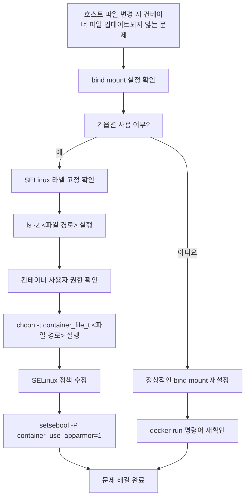

# Deep Dive - 트러블슈팅

## 시나리오 1: 컨테이너가 정상적으로 시작되지 않는 문제

### 트러블슈팅 흐름도

```mermaid
graph TD
  A[오류 발생: npm install 실패] --> B[워크디렉토리 점검]
  B --> C[DOCKERFILE WORKDIR 설정 확인]
  C -->|예| D[바인드 마운트 설정 확인]
  D -->|예| E[명령어 실행 경로 점검]
  E --> F[정상 작동]
  F --> G[nodemon 로그 확인]
  G --> H[애플리케이션 실행 완료]
  C -->|아니요| I[WORKDIR 재설정]
  I --> J[예: WORKDIR /app]
  J --> C
  D -->|아니요| K[바인드 마운트 재설정]
  K --> L[예: -v ./web:/app/web]
  L --> D
  E -->|아니요| M[명령어 경로 수정]
  M --> N[예: sh -c "cd /app && npm install"]
  N --> E
```

**참고 이미지**:
- [이미지 보기](https://docs.docker.com/develop/develop-images/dockerfile-best-practices/#understand-layer-ordering)
- [이미지 보기](https://docs.docker.com/registry/builds/using-buildkit/#buildkit-secrets)
- [이미지 보기](https://docs.docker.com/engine/reference/run/#mount-points)


### 시나리오 설명

<details>
<summary>문제 상황 보기</summary>

Docker 컨테이너가 실행 시 'npm install' 단계에서 오류가 발생하며 로그에 'No such file or directory'가 나타납니다.

</details>

### 원인 분석

<details>
<summary>원인 분석 보기</summary>

워크디렉토리 설정이 누락되어 npm 명령어가 실행될 디렉토리가 잘못 지정된 상태입니다.

</details>

### 원인 확인 방법

<details>
<summary>진단 단계 보기</summary>

docker inspect <container-id> 명령어로 컨테이너의 마운트 포인트 확인

docker logs <container-id>로 로그를 확인하여 오류 메시지 분석

npm install 명령어가 실행되는 디렉토리 경로를 재검토

</details>

### 수정 방법

<details>
<summary>해결 단계 보기</summary>

docker run 명령어에 -w /app 플래그 추가하여 작업 디렉토리 명시

npm install --force로 의존성 다시 설치

docker-compose up --build 명령어로 이미지 재빌드 후 실행

</details>

### 정상 확인 방법

<details>
<summary>검증 단계 보기</summary>

docker logs -f <container-id>로 로그 확인

ls -la /app 디렉토리 내 파일 목록 확인

npm run dev 명령어로 개발 서버 실행 시도

</details>

---

## 시나리오 2: 바인드 마운트 파일 변경이 동기화되지 않는 문제

### 트러블슈팅 흐름도



**참고 이미지**:
- [이미지 보기](https://docs.docker.com/advanced/containers/01-bind-mounts.md)
- [이미지 보기](https://docs.docker.com/engine/security/seccomp/)
- [이미지 보기](https://docs.docker.com/engine/reference/run/#security-options)


### 시나리오 설명

<details>
<summary>문제 상황 보기</summary>

호스트 파일을 컨테이너에 바인드 마운트했으나, 파일 변경 시 컨테이너 내 파일이 업데이트되지 않습니다.

</details>

### 원인 분석

<details>
<summary>원인 분석 보기</summary>

bind mount 설정 시 'Z' 옵션으로 SELinux 라벨이 고정되어 컨테이너가 파일을 수정할 수 없는 상태입니다.

</details>

### 원인 확인 방법

<details>
<summary>진단 단계 보기</summary>

docker inspect <container-id>로 마운트 옵션 확인

ls -Z /app 경로에서 SELinux 라벨 확인

docker-compose.yml 파일에서 volumes 설정 검토

</details>

### 수정 방법

<details>
<summary>해결 단계 보기</summary>

docker run 명령어에 :z 옵션 대신 :rw로 마운트 권한 변경

chmod -R 777 /app 경로로 파일 권한 재설정

docker-compose down && docker-compose up --build 명령어로 컨테이너 재시작

</details>

### 정상 확인 방법

<details>
<summary>검증 단계 보기</summary>

echo 'test' > /app/test.txt 명령어로 파일 생성 후 확인

docker logs <container-id>로 파일 변경 로그 확인

ls -la /app/test.txt 파일 존재 여부 검증

</details>

---

