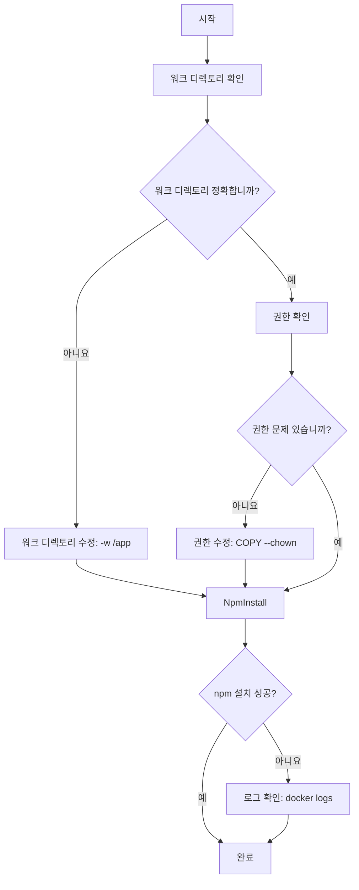
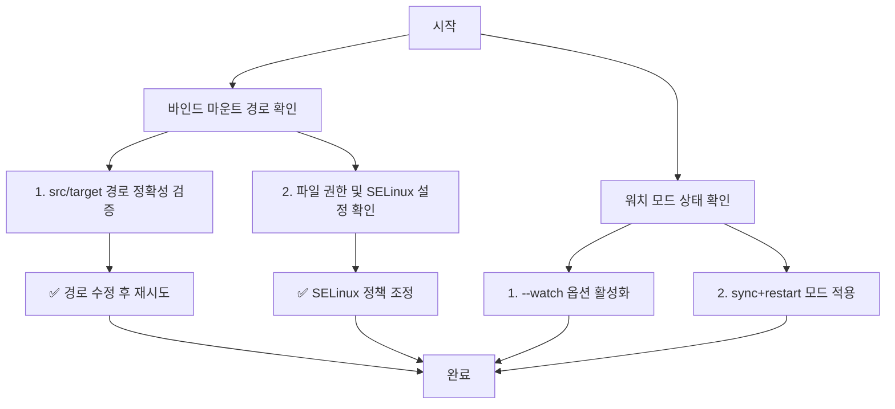

# 📘 Week 1 - Day 4

  <a href="service_understanding.md" style="color: white; text-decoration: none; padding: 8px 16px; background: rgba(255,255,255,0.2); border-radius: 5px; font-weight: bold;">⬅️ 이전: 📚 서비스 이해</a>
  <a href="../README.md" style="color: white; text-decoration: none; padding: 8px 16px; background: rgba(255,255,255,0.3); border-radius: 5px; font-weight: bold;">🏠 목차</a>
  <a href="handson_step1.md" style="color: white; text-decoration: none; padding: 8px 16px; background: rgba(255,255,255,0.2); border-radius: 5px; font-weight: bold;">다음: 🛠️ Hands-on Lab - Step 1 ➡️</a>

---

# Deep Dive - 트러블슈팅

## 🔍 시나리오 1: 컨테이너가 정상적으로 시작되지 않는 문제

### 트러블슈팅 흐름도

**참고 이미지**:
- [이미지 보기](https://docs.docker.com/develop/develop-images/dockerfile-best-practices/#understand-layer-ordering)
- [이미지 보기](https://docs.docker.com/engine/reference/commandline/buildx/#ssh)
- [이미지 보기](https://docs.docker.com/engine/reference/run/#mount-points)

### 🔍 시나리오 설명

Docker 컨테이너가 실행 시 'npm install' 단계에서 중단되고 오류 메시지가 발생합니다.

### 🔬 원인 분석

워크 디렉토리 설정이 잘못되어 package.json 파일이 정확히 위치하지 않거나, 권한 문제로 npm 설치가 실패했습니다.

### 🔎 원인 확인 방법

docker inspect <container-id> 명령으로 컨테이너의 설정 확인

docker logs <container-id> 명령으로 로그 확인

Dockerfile에 WORKDIR 설정이 정확하게 적용되었는지 확인

### 🔧 수정 방법

--mount type=bind,src=.,target=/app 옵션을 추가해 호스트 디렉토리와 컨테이너 디렉토리 매핑

npm install 명령 전에 chown 명령으로 파일 권한 변경: chown -R app:app /app

docker-compose up --build 명령으로 이미지 재빌드

### ✔️ 정상 확인 방법

docker logs -f <container-id> 명령으로 npm install 완료 여부 확인

npm run dev 명령으로 개발 서버 실행 시 로그 확인

src/index.js 파일 수정 후 변경 사항이 반영되는지 확인

---

## 🔍 시나리오 2: 바인드 마운트 파일 변경이 반영되지 않는 문제

### 트러블슈팅 흐름도

**참고 이미지**:
- [이미지 보기](https://docs.docker.com/compose/reference/options/#watch)
- [이미지 보기](https://docs.docker.com/engine/reference/run/#mount-settings)
- [이미지 보기](https://docs.docker.com/storage/containers/)

### 🔍 시나리오 설명

호스트 파일을 컨테이너에 바인드 마운트했으나, 수정한 파일이 컨테이너 내에서 반영되지 않습니다.

### 🔬 원인 분석

바인드 마운트 경로 설정이 잘못되었거나, SELinux 정책으로 파일 접근 권한이 차단되었거나, watch 모드가 비활성화된 상태입니다.

### 🔎 원인 확인 방법

docker inspect <container-id> 명령으로 바인드 마운트 경로 확인

docker stats <container-id> 명령으로 파일 시스템 사용량 점검

docker-compose.yml 파일에서 volumes 섹션 확인

### 🔧 수정 방법

--mount type=bind,src=./web,target=/app/web:z 옵션으로 SELinux 정책 적용

docker-compose up --build --force-recreate 명령으로 컨테이너 재시작

docker-compose.yml 파일에 watch: true 옵션 추가 후 서비스 재구동

### ✔️ 정상 확인 방법

호스트 파일 수정 후 docker logs -f <container-id> 명령으로 변경 사항 확인

src/index.js 파일 수정 후 변경이 컨테이너에 반영되는지 확인

docker-compose down && docker-compose up 명령으로 서비스 재배포 후 검증

---

  <h3 style="margin: 0 0 10px 0;">🎓 Week 1 - Day 4 학습 완료!</h3>
  
다음 단계로 계속 진행하세요

  <a href="service_understanding.md" style="color: white; text-decoration: none; padding: 10px 20px; background: rgba(255,255,255,0.2); border-radius: 5px; font-weight: bold; font-size: 14px;">⬅️ 이전 📚 서비스 이해</a>
  <a href="../README.md" style="color: white; text-decoration: none; padding: 10px 20px; background: rgba(255,255,255,0.3); border-radius: 5px; font-weight: bold; font-size: 14px;">🏠 목차로</a>
  <a href="handson_step1.md" style="color: white; text-decoration: none; padding: 10px 20px; background: rgba(255,255,255,0.2); border-radius: 5px; font-weight: bold; font-size: 14px;">다음 ➡️ 🛠️ Hands-on Lab - Step 1</a>

---

  
💡 <strong>Tip:</strong> 실습 중 문제가 발생하면 공식 문서를 참고하세요

  
📅 Week 1 Day 4 | 🎯 DevOps 6개월 교육과정

