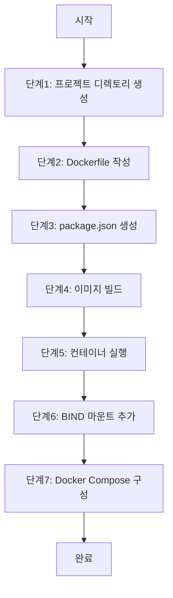

# 📘 Week 1 - Day 4

<div style="display: flex; justify-content: space-between; align-items: center; padding: 10px; background: linear-gradient(135deg, #667eea 0%, #764ba2 100%); border-radius: 10px; color: white;">
  <a href="deep_dive.md" style="color: white; text-decoration: none; padding: 8px 16px; background: rgba(255,255,255,0.2); border-radius: 5px; font-weight: bold;">⬅️ 이전: 🔍 Deep Dive</a>
  <a href="../README.md" style="color: white; text-decoration: none; padding: 8px 16px; background: rgba(255,255,255,0.3); border-radius: 5px; font-weight: bold;">🏠 목차</a>
  <a href="handson_step2.md" style="color: white; text-decoration: none; padding: 8px 16px; background: rgba(255,255,255,0.2); border-radius: 5px; font-weight: bold;">다음: 🛠️ Hands-on Lab - Step 2 ➡️</a>
</div>

---

# 👉 Hands-on Lab - Step 1

## 🎯 실습 개요

**제목**: Docker 컨테이너 개발 환경 구성 실습

**목적**: Docker를 사용하여 실시간 코드 변경을 반영하는 개발 환경을 구성하고, 컨테이너 관리 기법을 익히는 실습

**학습 목표**:
- Docker 컨테이너에 실시간 코드 변경을 반영하는 방법을 이해
- BIND 마운트와 WATCH 모드를 활용한 개발 환경 구성을 수행
- Docker Compose를 사용한 복수 서비스 관리 기법을 익히기

**예상 소요 시간**: 45분

**난이도**: Beginner

### 실습 흐름도



**참고 이미지**:
- [이미지 보기](https://docs.example.com/image1.png)
- [이미지 보기](https://docs.example.com/image2.png)
- [이미지 보기](https://docs.example.com/image3.png)

## 📋 사전 요구사항

- Docker Desktop 24.0+ 설치
  - 설치 가이드: https://docs.docker.com/desktop/install/
- AWS CLI 구성
  - 설치: https://docs.aws.amazon.com/cli/latest/userguide/getting-started-install.html
  - 설정: https://docs.aws.amazon.com/cli/latest/userguide/cli-configure-quickstart.html
- Docker Compose 기본 지식
  - 공식 문서: https://docs.docker.com/compose/

## ⚙️ 환경 설정

Docker Desktop 설치 후 Docker CLI 환경 설정
  - 공식 가이드: https://docs.docker.com/engine/install/

AWS CLI 구성 및 권한 설정
  - 설정 문서: https://docs.aws.amazon.com/cli/latest/userguide/cli-configure-profiles.html

---

## 👉 Step 1: 프로젝트 디렉토리 생성

**목표**: 실습용 디렉토리 구조를 생성합니다

**명령어**:

```bash
mkdir my-docker-app && cd my-docker-app

```

**예상 출력**:

```

현재 디렉토리가 my-docker-app로 변경됨

```

**확인 방법**:

```bash
pwd

```

**문제 해결**:
- 문제: 디렉토리 생성 실패
  해결: sudo 권한으로 다시 시도하거나 파일 시스템 권한 확인


---

<div style="text-align: center; padding: 20px; background: linear-gradient(135deg, #f093fb 0%, #f5576c 100%); border-radius: 10px; color: white; margin: 20px 0;">
  <h3 style="margin: 0 0 10px 0;">🎓 Week 1 - Day 4 학습 완료!</h3>
  <p style="margin: 0; opacity: 0.9;">다음 단계로 계속 진행하세요</p>
</div>

<div style="display: flex; justify-content: space-between; align-items: center; padding: 15px; background: linear-gradient(135deg, #667eea 0%, #764ba2 100%); border-radius: 10px;">
  <a href="deep_dive.md" style="color: white; text-decoration: none; padding: 10px 20px; background: rgba(255,255,255,0.2); border-radius: 5px; font-weight: bold; font-size: 14px;">⬅️ 이전<br/><span style="font-size: 12px; opacity: 0.8;">🔍 Deep Dive</span></a>
  <a href="../README.md" style="color: white; text-decoration: none; padding: 10px 20px; background: rgba(255,255,255,0.3); border-radius: 5px; font-weight: bold; font-size: 14px;">🏠<br/><span style="font-size: 12px;">목차로</span></a>
  <a href="handson_step2.md" style="color: white; text-decoration: none; padding: 10px 20px; background: rgba(255,255,255,0.2); border-radius: 5px; font-weight: bold; font-size: 14px;">다음 ➡️<br/><span style="font-size: 12px; opacity: 0.8;">🛠️ Hands-on Lab - Step 2</span></a>
</div>

---

<div style="text-align: center; padding: 10px; color: #666; font-size: 12px;">
  <p>💡 <strong>Tip:</strong> 실습 중 문제가 발생하면 공식 문서를 참고하세요</p>
  <p style="margin-top: 5px;">📅 Week 1 Day 4 | 🎯 DevOps 6개월 교육과정</p>
</div>
