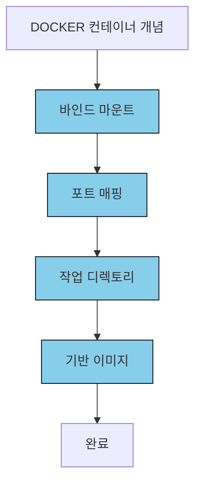

# 서비스 이해 (Service Understanding)

## 1. 배경 정보

<details>
<summary>배경 정보 보기</summary>

Docker 컨테이너는 애플리케이션과 필요한 도구들을 하나의 패키지로 묶어 실행 환경을 일관되게 유지하는 기술입니다. 예를 들어, 데브옵스 환경에서 개발자가 로컬 컴퓨터에서 작성한 코드를 실시간으로 컨테이너에 반영할 수 있도록 해줍니다. 

### 핵심 개념 정의
- **바인드 마운트**: 호스트 컴퓨터의 파일을 컨테이너에 연결해 실시간 동기화를 가능하게 하는 기능입니다. 예를 들어, `C:\Users\Name\project` 폴더를 컨테이너의 `/app` 폴더에 연결하면, 호스트에서 코드를 수정하면 컨테이너에서도 자동으로 반영됩니다.
- **포트 매핑**: 호스트와 컨테이너 간의 네트워크 포트 연결을 설정합니다. 예를 들어, 호스트의 `3000` 포트를 컨테이너의 `3000` 포트로 연결하면, 외부에서 `http://localhost:3000`으로 애플리케이션을 접근할 수 있습니다.
- **워크 디렉토리**: 컨테이너 내에서 명령어 실행 시 기준이 되는 디렉토리입니다. 예를 들어, `cd /app` 명령어로 이동한 후 `npm install`을 실행하면, 해당 디렉토리가 작업 디렉토리입니다.
- **기반 이미지**: Dockerfile에서 사용하는 기반 컨테이너 이미지로, 애플리케이션의 실행 환경을 제공합니다. 예를 들어, `node:24-alpine`은 Node.js 환경을 제공하는 이미지입니다.

### 실습 단계
1. **Dockerfile 작성**: 애플리케이션을 실행할 수 있는 이미지를 생성합니다. 예:  
   ```Dockerfile
   FROM node:24-alpine
   WORKDIR /app
   COPY . .
   RUN npm install
   CMD ["npm", "run", "dev"]
   ```
2. **이미지 생성**: `docker build -t my-app .` 명령어로 Dockerfile을 기반으로 이미지 생성합니다.
3. **컨테이너 실행**: `docker run -d -p 3000:3000 -v C:\Users\Name\project:/app my-app` 명령어로 컨테이너 실행합니다.
4. **로그 확인**: `docker logs -f <container_id>` 명령어로 실시간 로그 확인합니다.

### 인포그래픽
```mermaid
graph TD
  Start[DOCKER CONTAINERS 시작] --> Step1[DOCKERFILE 기반 이미지 설정]
  Step1 --> Step2[바인드 마운트 설정]
  Step2 --> Step3[포트 매핑 구성]
  Step3 --> Step4[npm install 및 개발 서버 실행]
  Step4 --> Step5[컨테이너 로그 확인]
  Step5 --> Step6[실시간 코드 변경 감지(nodemon)]
  Step6 --> End[동기화 완료]
```

**참고 이미지**:
- [바인드 마운트 예시](https://docs.docker.com/storage/bind-mounts/)
- [포트 매핑 설정](https://docs.docker.com/network/ports/)
- [Dockerfile 예시](https://docs.docker.com/engine/reference/builder/)
</details>

## 2. 핵심 개념

<details>
<summary>핵심 개념 보기</summary>

- **바인드 마운트**: 개발 중에는 실시간 코드 변경 감지가 필요합니다. 예를 들어, `C:\Users\Name\project`를 컨테이너의 `/app`에 연결하면, 호스트에서 코드를 수정하면 컨테이저에서도 자동으로 반영됩니다. 이는 `--mount type=bind,source=C:\Users\Name\project,target=/app` 옵션으로 설정합니다.
- **포트 매핑**: 외부에서 애플리케이션에 접근하려면 포트를 연결해야 합니다. 예를 들어, 호스트의 `3000` 포트를 컨테이너의 `3000` 포트로 연결하면, `http://localhost:3000`에서 애플리케이션을 실행할 수 있습니다. 이는 `-p 3000:3000` 옵션으로 설정합니다.
- **워크 디렉토리**: 컨테이너가 실행될 때 기준이 되는 디렉토리입니다. 예를 들어, `WORKDIR /app`을 설정하면, `npm install` 명령어는 `/app` 디렉토리에서 실행됩니다.
- **기반 이미지**: 컨테이너의 실행 환경을 제공합니다. 예를 들어, `node:24-alpine`은 Node.js 환경을 제공하는 이미지로, 애플리케이션을 실행할 수 있습니다.

### 인포그래픽


**참고 이미지**:
- [바인드 마운트 설정](https://docs.docker.com/storage/bind-mounts/)
- [포트 매핑 설정](https://docs.docker.com/network/ports/)
- [Dockerfile 예시](https://docs.docker.com/engine/reference/builder/)
</details>

## 3. 장단점

<details>
<summary>장단점 보기</summary>

**장점**:
- **포트폴리오 이동성**: 개발/테스트/생산 환경에서 동일한 실행 환경을 제공합니다. 예를 들어, 로컬에서 개발한 애플리케이션을 서버에 배포할 때도 동일한 환경을 사용할 수 있습니다.
- **리소스 격리성**: 각 컨테이너 간 자원 분리로 안정성 향상. 예를 들어, 하나의 컨테이너가 충돌하더라도 다른 컨테이너는 영향을 받지 않습니다.
- **스케일링 용이성**: 컨테이너 기반으로 수평 확장이 용이. 예를 들어, 트래픽이 증가하면 더 많은 컨테이너를 추가할 수 있습니다.

**단점**:
- **복잡한 네트워크 구성**: 다수의 컨테이너 간 통신 설정이 필요할 수 있습니다. 예를 들어, 서비스 간 통신을 설정할 때 복잡한 네트워크 구성이 필요할 수 있습니다.
- **보안 위험**: 바인드 마운트 시 호스트 시스템에 대한 접근 권한 위험. 예를 들어, 호스트의 중요한 파일을 컨테이너에 연결하면, 악성 코드가 호스트 파일을 수정할 수 있습니다.
</details>

## 4. 자주 사용되는 사례

<details>
<summary>사용 사례 보기</summary>

1. **개발 환경 구성**: 실시간 코드 변경 감지 및 로컬 서버 실행. 예를 들어, 개발자는 로컬에서 코드를 수정하면 컨테이너에서도 자동으로 반영됩니다.
2. **마이크로서비스 아키텍처**: 독립적인 서비스 단위로 배포 및 관리. 예를 들어, 사용자 관리 서비스와 주문 서비스를 별도의 컨테이너로 관리합니다.
3. **CI/CD 파이프라인**: 자동화된 빌드 및 테스트 환경 제공. 예를 들어, GitHub Actions에서 Docker 컨테이너를 사용해 자동 빌드 및 테스트를 수행합니다.
</details>

## 5. 연관 서비스

<details>
<summary>연관 서비스 보기</summary>

- **Docker Compose**: 여러 컨테이너를 관리하는 도구입니다. 예를 들어, `docker-compose.yml` 파일로 데이터베이스와 애플리케이션 컨테이너를 함께 실행할 수 있습니다.
- **Kubernetes**: 컨테이너를 자동화하여 관리하는 시스템입니다. 예를 들어, 여러 노드에서 컨테이너를 배포하고 자동으로 복구할 수 있습니다.
- **Docker Swarm**: 컨테이너를 클러스터로 관리하는 도구입니다. 예를 들어, 여러 서버에 컨테이너를 배포하고 자동으로 균형을 맞출 수 있습니다.
</details>

## 6. 공식 문서 링크

- [Docker 공식 문서](https://docs.docker.com/)
- [Docker Compose 가이드](https://docs.docker.com/compose/)
- [공식 문서](https://hub.docker.com/)