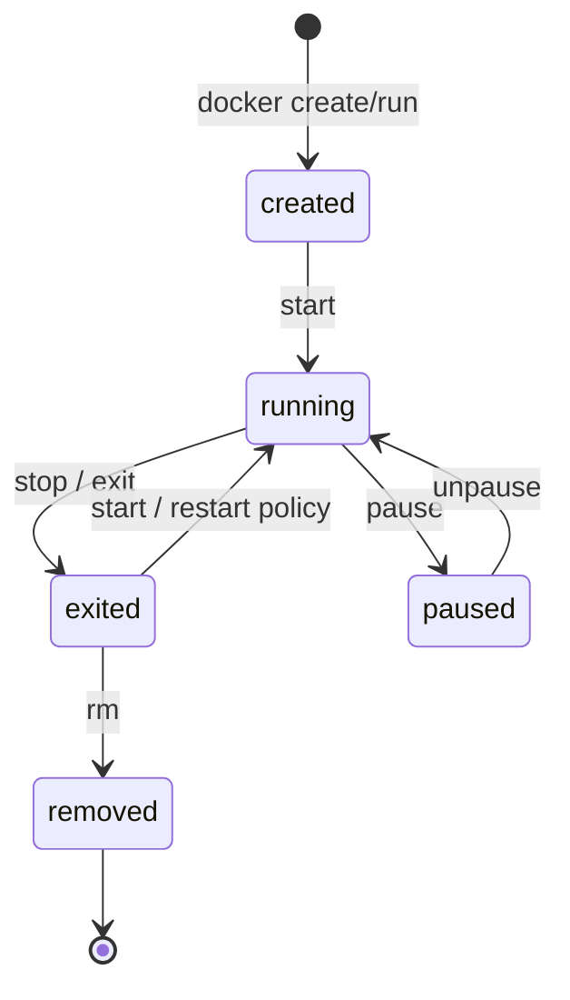
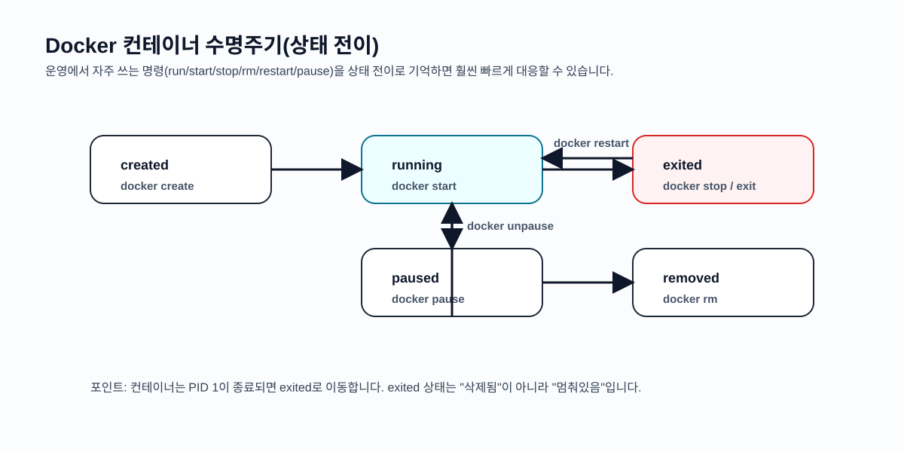
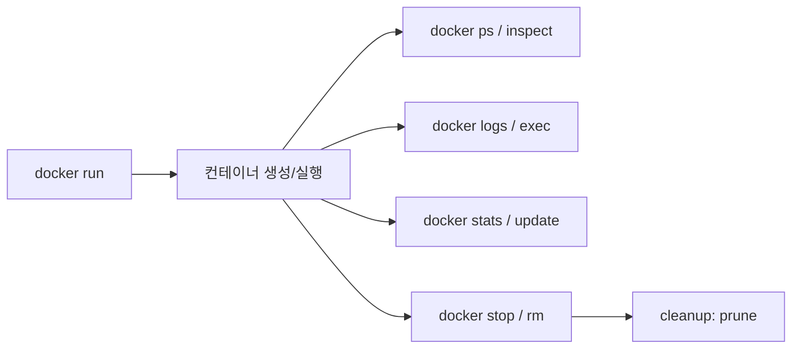
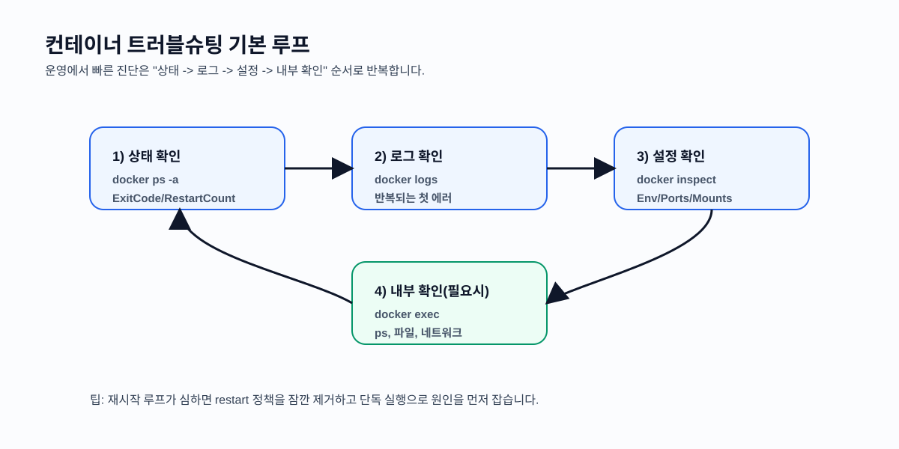

# 서비스 이해 (Service Understanding)

## 1. 배경 정보

배경 정보 보기

Docker를 도입하면 배포 단위가 "서버에 직접 설치한 프로세스"에서 "컨테이너"로 바뀝니다. 이때 운영 관점에서 중요한 질문은 다음과 같습니다.

- 컨테이너는 언제 시작/종료되며, 실패하면 어떻게 복구할 것인가?
- 로그는 어디에 남기고, 문제 발생 시 어떻게 확인할 것인가?
- 리소스(CPU/메모리)를 어떻게 제한해서 한 컨테이너가 호스트를 망가뜨리지 않게 할 것인가?
- 컨테이너의 수명은 기본적으로 짧고(immutable/ephemeral) 상태가 남지 않는데, 데이터는 어떻게 보존할 것인가?

이런 운영 질문에 답하기 위해 "컨테이너 관리(Container Management)"가 필요합니다. 이는 단순히 `docker run`으로 실행하는 것을 넘어, 컨테이너의 수명주기(lifecycle), 상태 관찰(observability), 장애 대응(restart/rollback), 리소스 통제(resource governance), 정리(cleanup)까지 포함합니다.

### 인포그래픽

## 2. 핵심 개념

핵심 개념 보기

- 컨테이너 상태와 수명주기: `created/running/exited/paused` 등 상태 전이를 이해하면 운영 명령이 자연스럽게 연결됩니다.
- PID 1과 시그널: 컨테이너 내부의 "첫 프로세스(PID 1)"가 종료되면 컨테이너도 종료됩니다. `docker stop`은 기본적으로 SIGTERM 후 SIGKILL 흐름으로 종료를 유도합니다.
- 로그(Logging): 기본적으로 컨테이너 표준 출력(stdout/stderr)이 로그로 취급됩니다. `docker logs`로 확인할 수 있지만, 운영에서는 로그 드라이버/중앙집중 수집을 같이 고려합니다.
- 재시작 정책(Restart policy): 실패 시 자동 복구를 위한 정책(`no`, `on-failure`, `always`, `unless-stopped`)을 설정할 수 있습니다.
- 리소스 제한(Resource limits): CPU/메모리 제한은 호스트 수준에서 컨테이너가 사용할 수 있는 자원을 통제합니다(리눅스의 cgroups 개념과 연결).
- 마운트(Mount)/볼륨(Volume): 컨테이너는 기본적으로 상태가 남지 않으므로, 데이터는 볼륨/바인드 마운트로 분리합니다.
- 라벨(Labels)과 필터링: 운영에서 "내가 만든 컨테이너만" 안전하게 조회/정리하려면 라벨과 필터를 적극 활용합니다.

### 인포그래픽

## 3. 장단점

장단점 보기

**장점**:
- 빠른 장애 확인/대응: 상태/로그/재시작 정책을 통해 "죽으면 자동으로 살린다" 같은 기본 운영 패턴을 구현할 수 있습니다.
- 디버깅 효율: `exec`, `inspect`로 컨테이너 내부/설정을 즉시 확인할 수 있어 트러블슈팅이 빨라집니다.
- 리소스 거버넌스: CPU/메모리 제한으로 공유 호스트 환경에서 서비스 간 간섭을 줄일 수 있습니다.

**단점**:
- 데이터/상태 설계가 필요: 컨테이너는 기본적으로 ephemeral이므로, 저장소(볼륨/DB) 설계를 하지 않으면 데이터 유실이 발생합니다.
- 운영 옵션이 많아 실수 여지: 재시작 정책, 포트, 마운트, 권한, 네트워크 등 옵션을 잘못 설정하면 장애가 반복될 수 있습니다.

**언제 조심해야 하나**
- 개발 단계에서 `prune`/대량 삭제를 습관처럼 사용하면 중요한 이미지/볼륨까지 지울 수 있습니다. 라벨/필터 기반 정리를 권장합니다.

## 4. 자주 사용되는 사례

사용 사례 보기

1. 장애 대응: 컨테이너가 비정상 종료될 때 로그/exit code 확인 후 재시작 정책 또는 설정 수정
2. 운영 점검: `docker ps`, `docker stats`, `docker inspect`로 상태/리소스/설정 확인
3. 디버깅: `docker exec`로 내부 확인(프로세스, 파일, 환경 변수) 후 원인 분석
4. 데이터 유지: 볼륨을 붙여 컨테이너 교체(재배포)에도 데이터가 남도록 구성

## 5. 연관 서비스

연관 서비스 보기

- 오케스트레이션: Docker Compose(로컬), Kubernetes(운영)
- 관측/모니터링: cAdvisor, Prometheus/Grafana, 로그 수집(Fluent Bit, Loki/ELK 등)
- 리소스/프로세스 관리: systemd(호스트), containerd(런타임)
- 대안: VM 기반 프로세스 관리(systemd 서비스), PaaS 런타임(관리형 플랫폼)

## 6. 공식 문서 링크

- [Docker Docs](https://docs.docker.com/)
- [docker container (CLI)](https://docs.docker.com/reference/cli/docker/container/)
- [docker run (CLI)](https://docs.docker.com/reference/cli/docker/container/run/)
- [docker logs (CLI)](https://docs.docker.com/reference/cli/docker/container/logs/)
- [docker exec (CLI)](https://docs.docker.com/reference/cli/docker/container/exec/)
- [docker inspect (CLI)](https://docs.docker.com/reference/cli/docker/inspect/)
- [docker stats (CLI)](https://docs.docker.com/reference/cli/docker/container/stats/)
- [docker update (CLI)](https://docs.docker.com/reference/cli/docker/container/update/)
- [docker volume (CLI)](https://docs.docker.com/reference/cli/docker/volume/)
- [docker system prune (CLI)](https://docs.docker.com/reference/cli/docker/system/prune/)

## 7. 추가 자료

- "컨테이너는 상태를 저장하지 않는다"는 원칙과 볼륨 분리는 이후 Kubernetes 학습에서도 그대로 이어집니다.
- 외부 참고(이미지/도표가 포함된 페이지)
  - Docker Logging(공식): https://docs.docker.com/config/containers/logging/
  - Docker Volumes(공식): https://docs.docker.com/storage/volumes/
