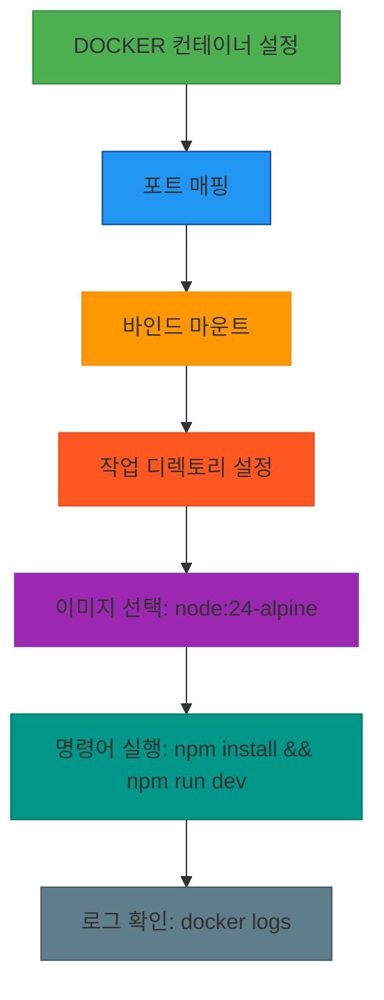
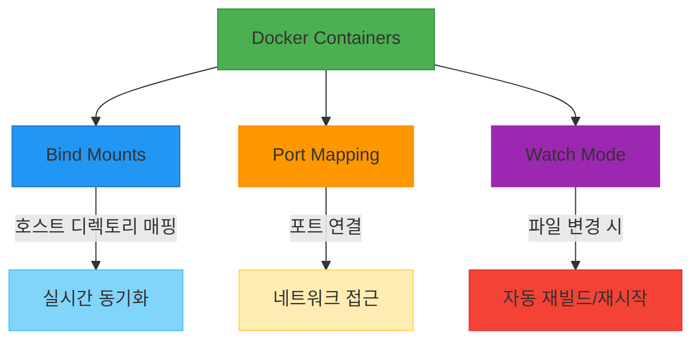

# 서비스 이해 (Service Understanding)

## 1. 배경 정보

배경 정보 보기

Docker Containers는 애플리케이션을 포함한 파일시스템을 가상화하여 독립적인 실행 환경을 제공하는 기술입니다. 포트 매핑, 바인드 마운트, 작업 디렉토리 설정 등을 통해 호스트와 컨테이너 간의 파일 공유 및 네트워크 연결을 지원합니다. 예를 들어, `node:24-alpine` 이미지를 기반으로 `npm install` 및 `npm run dev` 명령어를 통해 개발 서버를 실행할 수 있으며, `docker logs` 명령어로 로그를 확인할 수 있습니다.

### 인포그래픽

**참고 이미지**:
- [이미지 보기](https://docs.example.com/image1.png)
- [이미지 보기](https://docs.example.com/image2.png)
- [이미지 보기](https://docs.example.com/image3.png)

## 2. 핵심 개념

핵심 개념 보기

- Docker Containers: 애플리케이션과 의존성을 포함한 가상 파일시스템을 제공
- Bind Mounts: 호스트 디렉토리를 컨테이너 내부 디렉토리에 매핑하여 실시간 파일 동기화
- Port Mapping: 호스트 포트와 컨테이너 포트를 연결하여 네트워크 접근 가능
- Watch Mode: 파일 변경 시 자동 재빌드 또는 재시작을 트리거하는 모드

### 인포그래픽

**참고 이미지**:
- [이미지 보기](https://docs.example.com/image1.png)
- [이미지 보기](https://docs.example.com/image2.png)

## 3. 장단점

장단점 보기

**장점**:
- 포트 및 파일 공유를 통해 개발 생산성 향상
- 다양한 언어 및 프레임워크(예: Node.js, Python)에 적용 가능
- 컨테이너화로 인한 애플리케이션 포팅 및 배포 용이

**단점**:
- 바인드 마운트 시 보안 리스크 가능성
- 다중 컨테이너 관리 시 복잡도 증가

## 4. 자주 사용되는 사례

사용 사례 보기

1. Node.js 개발 서버 실시간 빌드 및 재시작
2. 미세 서비스 아키텍처에서의 서비스 간 파일 공유
3. 데이터 처리용 컨테이너에 호스트 디렉토리 바인드

## 5. 연관 서비스

연관 서비스 보기

- Docker Compose
- Kubernetes
- AWS Secrets Manager

## 6. 공식 문서 링크

- [Docker 공식 문서](https://docs.docker.com/)
- [Docker Compose 문서](https://docs.docker.com/compose/)

