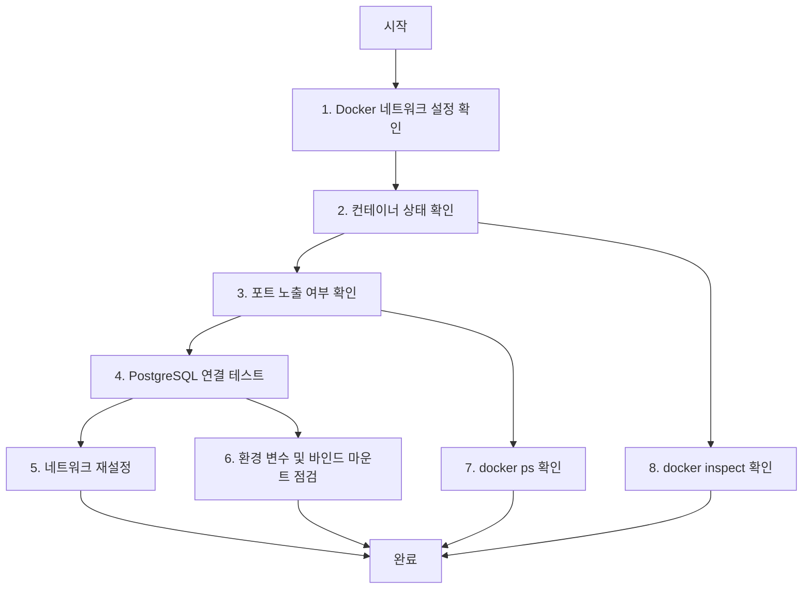
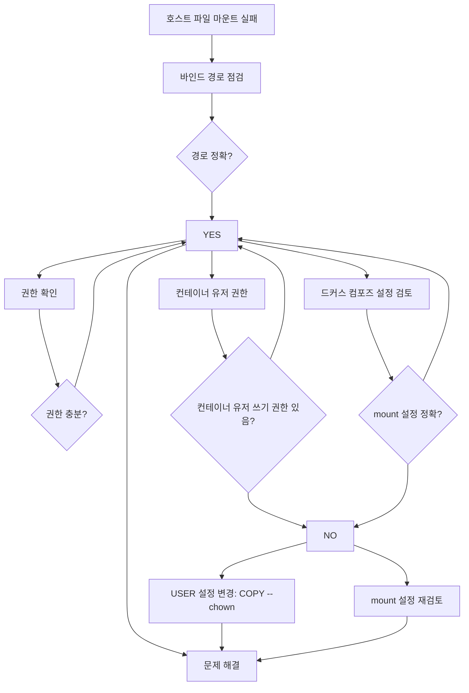

# Deep Dive - 트러블슈팅

## 시나리오 1: 컨테이너 간 네트워크 통신 실패

### 용어 정의
- **Bridge Network**: Docker가 기본으로 사용하는 네트워크 유형입니다. 컨테이너 간 통신을 가능하게 하며, 각 컨테이너가 고유한 IP 주소를 가집니다.
- **Custom Network**: 사용자가 직접 생성한 네트워크로, 특정 컨테이너들만 연결할 때 사용합니다.
- **Port Expose**: 호스트 컴퓨터의 포트를 컨테이너에 노출하여 외부에서 접근할 수 있도록 설정하는 기능입니다.

### 트러블슈팅 흐름도


### 시나리오 설명
Node.js 애플리케이션 컨테이너가 PostgreSQL 데이터베이스 컨테이너와 통신하지 못하는 문제입니다. 예를 들어, 애플리케이션이 데이터베이스에 연결하려고 시도했으나 연결 실패가 발생했습니다.

### 원인 분석
- Docker 네트워크 설정 오류 (예: bridge network vs custom network)
- 포트 노출 누락 (예: PostgreSQL의 5432 포트가 노출되지 않음)
- 컨테이너 간 IP 주소 통신 불가

### 원인 확인 방법
1. **docker network inspect bridge**  
   - 기본 네트워크 구성 확인  
   - 컨테이너 IP 주소, 네트워크 설정 확인  

2. **docker ps**  
   - 컨테이너의 포트 노출 여부 확인 (예: `0.0.0.0:5432->5432` 확인)  
   - 실행 중인 컨테이너 목록 확인  

3. **curl http://<db-container-ip>:5432**  
   - 직접 연결 테스트 (예: `curl http://172.17.0.2:5432`)  
   - 연결 성공 시 200 응답, 실패 시 오류 메시지 확인  

4. **docker network ls**  
   - 생성된 커스텀 네트워크 확인 (예: `my-network`)  

5. **docker inspect <container-id>**  
   - 네트워크 설정 세부 확인 (예: `Networks` 섹션 확인)  

### 수정 방법
1. **--network host 옵션 추가**  
   - 호스트 네트워크 사용 (예: `docker run --network host myapp`)  
   - 컨테이너가 호스트 네트워크를 직접 사용하여 통신 가능  

2. **docker-compose.yml에 networks 설정 추가**  
   ```yaml
   services:
     app:
       networks:
         - my-network
     db:
       networks:
         - my-network
   networks:
     my-network:
       driver: bridge
   ```
   - 컨테이너를 동일한 네트워크에 연결하여 통신 가능  

3. **-p 5432:5432 옵션으로 포트 노출**  
   - PostgreSQL의 5432 포트를 호스트 포트 5432로 노출 (예: `docker run -p 5432:5432 db`)  

4. **커스텀 네트워크 생성**  
   ```bash
   docker network create --driver bridge my-network
   ```
   - 사용자 정의 네트워크 생성 후 컨테이너 연결  

5. **컨테이너 네트워크 연결**  
   ```bash
   docker network connect my-network <container-id>
   ```
   - 컨테이너를 생성한 네트워크에 연결  

### 정상 확인 방법
1. **docker network inspect my-network**  
   - 연결된 컨테이너 확인 (예: `Containers` 섹션 확인)  

2. **docker exec -it <app-container> sh**  
   - 컨테이너 내부에서 `ping <db-container-ip>` 명령어로 통신 테스트  

3. **psql -h <db-container-ip> -U postgres**  
   - PostgreSQL에 직접 연결하여 데이터베이스 연결 성공 여부 확인  

4. **docker logs <app-container>**  
   - 애플리케이션 로그 확인 (예: 연결 실패 시 오류 메시지 확인)  

5. **curl http://localhost:3000/api/test**  
   - 외부에서 애플리케이션 접근 테스트 (예: `curl http://localhost:3000/api/test`)  

---

## 시나리오 2: 바인드 마운트 파일 접근 실패

### 용어 정의
- **Bind Mount**: 호스트 파일 시스템을 컨테이너에 연결하여 데이터 접근 가능하게 하는 기능입니다. 예: 호스트의 `/data` 디렉터리를 컨테이너의 `/app` 경로에 연결.

### 트러블슈팅 흐름도


### 시나리오 설명
호스트 파일 시스템을 컨테이너에 마운트했으나 애플리케이션이 파일을 읽지 못하는 문제입니다. 예를 들어, 애플리케이션이 `/app/data.txt` 파일을 읽으려고 시도했으나 접근 권한 없음 오류 발생.

### 원인 분석
- 바인드 마운트 경로 설정 오류 (예: 잘못된 경로 입력)
- 파일 접근 권한 부족 (예: 컨테이너 유저가 쓰기 권한 없음)
- 컨테이너 유저 설정 오류 (예: `root` 권한이 아닌 유저로 실행)

### 원인 확인 방법
1. **docker inspect <container-id>**  
   - 마운트 포인트 확인 (예: `Mounts` 섹션 확인)  
   - 호스트 경로와 컨테이너 경로 매핑 확인  

2. **ls -l /app 경로 확인**  
   - 호스트 파일 존재 여부 검증 (예: `ls -l /app/data.txt`)  
   - 파일 권한, 소유자 확인 (예: `-rw-r--r--` 확인)  

3. **docker exec -it <container-id> ls -l /app**  
   - 컨테이너 내부 파일 확인 (예: `/app/data.txt` 존재 여부 확인)  

4. **docker run 명령어 --mount 옵션 확인**  
   - 마운트 설정 검토 (예: `--mount type=bind,src=/host/path,target=/app`)  

5. **docker-compose.yml 파일의 volumes 설정 점검**  
   - 바인드 마운트 설정 확인 (예: `volumes: - type: bind, source: ./data, target: /app`)  

### 수정 방법
1. **--mount 옵션 추가**  
   ```bash
   docker run --mount type=bind,src=/host/path,target=/app myapp
   ```
   - 호스트의 `/host/path`를 컨테이너의 `/app`에 연결  

2. **docker-compose.yml에 volumes 설정 추가**  
   ```yaml
   volumes:
     - type: bind
       source: ./data
       target: /app
   ```
   - 현재 디렉터리의 `data` 폴더를 컨테이너의 `/app`에 연결  

3. **-v 옵션으로 바인드 마운트 설정**  
   ```bash
   docker run -v /host/path:/app myapp
   ```
   - 호스트의 `/host/path`를 컨테이너의 `/app`에 연결  

4. **--user 옵션으로 권한 설정**  
   ```bash
   docker run --user $(id -u):$(id -g) myapp
   ```
   - 호스트의 현재 유저 권한을 컨테이너에 전달  

5. **read-only 옵션으로 읽기 전용 설정**  
   ```bash
   docker run --mount type=bind,src=/host/path,target=/app,readonly myapp
   ```
   - 마운트 경로를 읽기 전용으로 설정  

### 정상 확인 방법
1. **docker exec -it <container-id> cat /app/testfile**  
   - 파일 접근 테스트 (예: `/app/testfile` 읽기)  

2. **docker run --rm -v /host/path:/app alpine ls -l /app**  
   - 마운트 검증 (예: `ls -l /app`로 파일 존재 여부 확인)  

3. **docker inspect <container-id> | grep Mounts**  
   - 마운트 설정 확인 (예: `Mounts` 섹션 확인)  

4. **docker-compose up --build**  
   - 구성 파일 재구성 (예: `docker-compose.yml` 수정 후 재실행)  

5. **docker logs <container-id>**  
   - 에러 로그 확인 (예: 파일 접근 권한 오류 확인)  

---

## 사전 지식 섹션
### Docker 네트워크 기초 개념
- **컨테이너**: 독립적인 애플리케이션 실행 환경입니다. 각 컨테이너는 고유한 네트워크 설정을 가집니다.
- **네트워크 드라이버**: Docker가 네트워크를 관리하는 방식입니다. `bridge`는 기본 드라이버로, 컨테이너 간 통신을 가능하게 합니다.
- **포트 노출**: 호스트 컴퓨터의 포트를 컨테이너에 연결하여 외부에서 접근할 수 있도록 설정합니다. 예: `docker run -p 80:80`으로 호스트 80포트를 컨테이너 80포트에 연결.