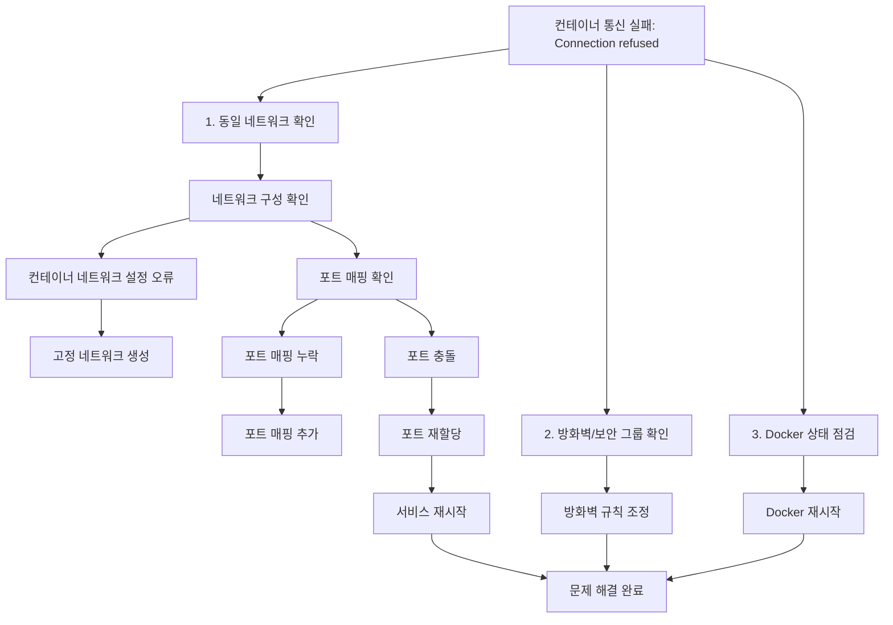
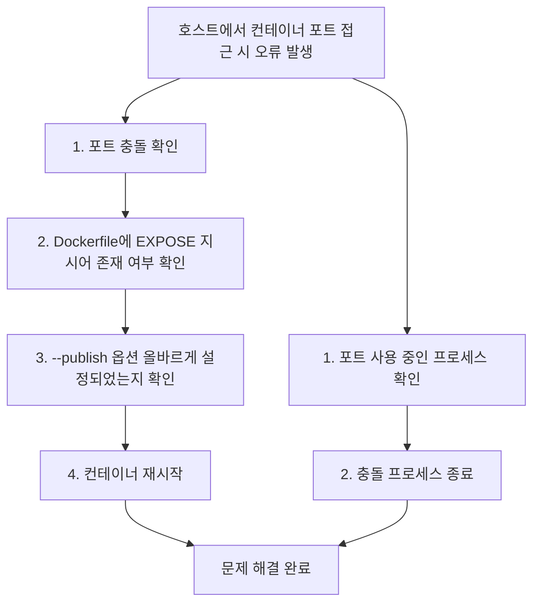

# Deep Dive - 트러블슈팅

## 시나리오 1: 컨테이너 간 네트워크 연결 실패

### 트러블슈팅 흐름도

**참고 이미지**:
- [이미지 보기](https://docs.docker.com/network/images/network-bridge.png)
- [이미지 보기](https://docs.docker.com/network/images/network-host.png)
- [이미지 보기](https://docs.docker.com/network/images/network-overlay.png)
- [이미지 보기](https://docs.docker.com/engine/reference/run/images/run-ports.png)
- [이미지 보기](https://docs.docker.com/storage/images/bind-mounts.png)
- [이미지 보기](https://docs.docker.com/network/images/network-custom.png)

### 시나리오 설명

문제 상황 보기

두 컨테이너가 서로 통신할 수 없고, 'Connection refused' 오류 발생

### 원인 분석

원인 분석 보기

Docker 네트워크 설정 오류 또는 서비스가 동일 네트워크에 정의되지 않음

### 원인 확인 방법

진단 단계 보기

docker network ls 명령어로 현재 네트워크 목록 확인

docker network inspect <network-name> 명령어로 네트워크 구성 검사

docker exec -it <container-id> sh 명령어로 컨테이너 내부에서 ping 명령어로 연결 테스트

curl http://<other-container-ip> 명령어로 외부 컨테이너 접근 시도

docker logs <container-id> 명령어로 로그 확인

### 수정 방법

해결 단계 보기

docker network create --driver bridge my-network 명령어로 커스텀 네트워크 생성

docker rm -f <container-id> && docker run -d --network my-network --name <container-name> <image> 명령어로 컨테이너 재부팅

docker network inspect my-network 명령어로 네트워크 구성 재확인

docker service create --network my-network <service-name> <image> 명령어로 서비스 재등록

docker network prune 명령어로 불필요한 네트워크 정리

### 정상 확인 방법

검증 단계 보기

docker network inspect my-network 명령어로 네트워크 상태 확인

curl http://<other-container-ip> 명령어로 연결 성공 여부 검증

docker exec -it <container-id> ping <other-container-ip> 명령어로 ICMP 테스트

docker stats <container-id> 명령어로 네트워크 통계 확인

docker network ls 명령어로 최종 네트워크 상태 확인

---

## 시나리오 2: 포트 매핑 오류로 외부 접근 실패

### 트러블슈팅 흐름도

### 시나리오 설명

문제 상황 보기

호스트에서 컨테이너 포트 접근 시 'Address already in use' 또는 'Connection refused' 오류 발생

### 원인 분석

원인 분석 보기

Dockerfile에 EXPOSE 지시어 누락 또는 --publish 옵션 설정 오류

### 원인 확인 방법

진단 단계 보기

docker ps --format 'table {{.PORTS}}' 명령어로 포트 매핑 확인

docker inspect <container-id> | grep -i port 명령어로 포트 정보 추출

netstat -tuln | grep <port-number> 명령어로 호스트 포트 확인

curl http://localhost:<host-port> 명령어로 접근 테스트

docker logs <container-id> 명령어로 컨테이너 로그 확인

### 수정 방법

해결 단계 보기

Dockerfile에 EXPOSE <container-port> 추가 후 rebuild 수행

docker stop <container-id> && docker rm <container-id> 명령어로 컨테이너 제거

docker run -d -p <host-port>:<container-port> --name <container-name> <image> 명령어로 재시작

docker network inspect <network-name> 명령어로 네트워크 구성 확인

docker system prune -a 명령어로 이전 컨테이너 정리

### 정상 확인 방법

검증 단계 보기

docker ps --format 'table {{.PORTS}}' 명령어로 포트 매핑 재확인

curl http://localhost:<host-port> 명령어로 접근 성공 여부 검증

netstat -tuln | grep <host-port> 명령어로 호스트 포트 확인

docker inspect <container-id> | grep -i port 명령어로 포트 정보 재검사

docker stats <container-id> 명령어로 네트워크 상태 확인

---

