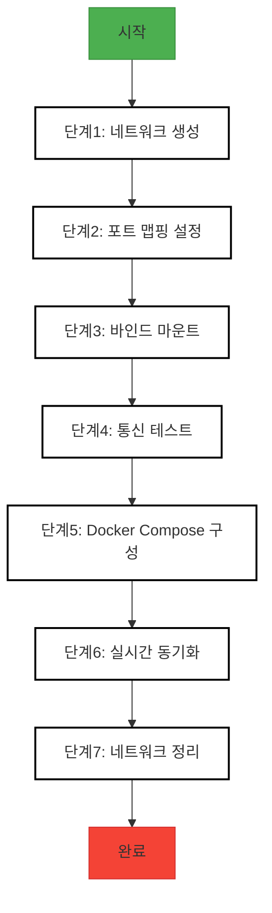

# Hands-on Lab - Step 1

## 실습 개요

**제목**: Docker 네트워킹 실습

**목적**: Docker 네트워크 구성, 컨테이너 통신, 포트 맵핑, 바인드 마운트 등을 이해하고 실습

**학습 목표**:
- Docker 네트워크 생성 및 확인 방법 익히기
- 컨테이너 간 통신 및 포트 맵핑 설정 실습
- 바인드 마운트를 통한 호스트 파일 시스템 연동 방법 학습
- Docker Compose를 활용한 네트워크 구성
- 실시간 파일 동기화(watch 모드) 설정
- 네트워크 문제 해결 전략 연습
- 컨테이너 네트워크 모니터링 및 정리 방법 습득

**예상 소요 시간**: 45분

**난이도**: Beginner

### 실습 흐름도



**참고 이미지**:
- [이미지 보기](https://docs.example.com/docker-networking-architecture.png)
- [이미지 보기](https://docs.example.com/port-mapping-diagram.png)
- [이미지 보기](https://docs.example.com/bind-mount-example.png)
- [이미지 보기](https://docs.example.com/docker-compose-network.png)
- [이미지 보기](https://docs.example.com/watch-mode-illustration.png)


## 사전 요구사항

<details>
<summary>사전 요구사항 보기</summary>

- Docker Desktop 설치 및 실행 중인 환경
- 프로젝트 디렉토리에 Dockerfile 및 package.json 파일 존재
- bash shell 접근 권한
- npm 패키지 설치 환경

</details>

## 환경 설정

<details>
<summary>환경 설정 보기</summary>

프로젝트 디렉토리 생성: mkdir docker-networking && cd docker-networking

Dockerfile 생성: nano Dockerfile

package.json 파일 생성: nano package.json

필요한 패키지 설치: npm init -y && npm install express

</details>

---

## Step 1: Docker 네트워크 생성

**목표**: 브리지 네트워크를 생성하고 구성 확인

**명령어**:
<details>
<summary>명령어 보기</summary>

```bash
docker network create my_custom_network # 커스텀 네트워크 생성
docker network ls # 생성된 네트워크 확인
```

</details>

**예상 출력**:
<details>
<summary>예상 출력 보기</summary>

```
my_custom_network 네트워크 목록에 표시됨
```

</details>

**확인 방법**:
<details>
<summary>확인 방법 보기</summary>

```bash
docker network inspect my_custom_network
```

</details>

**문제 해결**:
<details>
<summary>문제 해결 보기</summary>

- 문제: 네트워크 생성 실패 → docker 서비스 상태 확인: systemctl status docker
- 문제: 권한 오류 → sudo로 명령어 재실행

</details>

