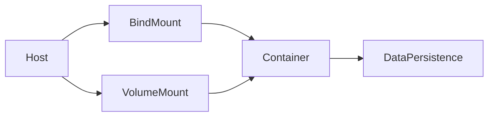

# 퀴즈 (Quiz)

## 질문 1

**Docker 컨테이너에서 작업 디렉토리를 설정하는 옵션은 무엇인가요?**

A) -w  
B) --mount  
C) -p  
D) --env  

<details>
<summary>정답 및 해설 보기</summary>

**답**: A

**설명**: `-w` 옵션은 Docker 컨테이너가 실행될 때 작업 디렉토리를 설정합니다. 예를 들어, `-w /app`은 컨테이너 내부의 `/app` 디렉토리를 작업 디렉토리로 지정합니다. 이는 파일을 생성하거나 수정할 때 기준이 되는 경로입니다.  
**예시**:  
```bash
docker run -w /app my-image ls
```
위 명령어는 컨테이너 내부의 `/app` 디렉토리에서 파일 목록을 보여줍니다.  
**용어 정의**:  
- **작업 디렉토리**: 컨테이너에서 명령어를 실행할 때 기준이 되는 경로입니다.  
- **-w 옵션**: 작업 디렉토리를 명시적으로 설정하는 Docker 실행 옵션입니다.

</details>

---

## 질문 2

**npm install && npm run dev 명령어가 실행될 때 어떤 결과를 기대할 수 있나요?**

A) 빌드 완료 후 서버 종료  
B) 개발 서버가 실시간으로 실행됨  
C) Docker 이미지 삭제  
D) 호스트 파일 시스템 복사  

<details>
<summary>정답 및 해설 보기</summary>

**답**: B

**설명**: `npm install`은 프로젝트에 필요한 패키지(예: Node.js 모듈)를 설치합니다. `npm run dev`는 개발 환경에서 서버를 실행하며, `nodemon`과 같은 도구를 사용해 코드 변경 시 자동으로 서버를 재시작합니다. 이는 실시간으로 코드 수정을 반영할 수 있어 개발 효율성을 높입니다.  
**예시**:  
```bash
npm install
npm run dev
```
위 명령어는 먼저 의존성 패키지를 설치한 후, 개발 서버를 실행합니다. 코드를 수정하면 서버가 자동으로 재시작됩니다.  
**용어 정의**:  
- **npm run dev**: 개발 환경에서 서버를 실행하는 npm 스크립트입니다.  
- **nodemon**: 코드 변경 시 자동으로 서버를 재시작하는 도구입니다.

</details>

---

## 질문 3

**bind mount와 volume mount의 주요 차이점은 무엇인가요?**

A) bind mount는 실시간 동기화 가능, volume mount는 데이터 지속성  
B) bind mount는 파일 시스템 변경 불가, volume mount는 가능  
C) bind mount는 컨테이너 간 공유 불가, volume mount는 가능  
D) bind mount는 호스트 파일 시스템만 사용 가능  

<details>
<summary>정답 및 해설 보기</summary>

**답**: A

**설명**:  
- **bind mount**: 호스트 파일 시스템을 컨테이너에 직접 연결해 데이터를 실시간으로 동기화합니다. 예를 들어, 호스트의 `/data` 디렉토리를 컨테이너의 `/app/data`에 마운트하면, 파일 변경은 즉시 반영됩니다.  
- **volume mount**: Docker가 관리하는 볼륨을 사용해 데이터를 저장합니다. 이는 데이터 지속성(예: 컨테이너 삭제 후 데이터 유지)을 위한 주요 방법입니다.  
**다이어그램**:  

**용어 정의**:  
- **bind mount**: 호스트 파일 시스템을 컨테이너에 연결하는 방식입니다.  
- **volume mount**: Docker가 관리하는 볼륨을 사용해 데이터를 저장하는 방식입니다.

</details>

---

## 질문 4

**Docker bind mount에서 'Z' 옵션의 주요 효과는 무엇인가요?**

A) SELinux 라벨을 자동으로 변경  
B) 호스트 파일 시스템을 읽기 전용으로 설정  
C) 여러 컨테이너가 동일한 마운트를 공유 가능  
D) 마운트 경로를 암호화 처리  

<details>
<summary>정답 및 해설 보기</summary>

**답**: C

**설명**:  
- **'Z' 옵션**: SELinux 보안 정책을 고정해 여러 컨테이너가 동일한 bind mount를 공유할 수 있도록 합니다. SELinux는 시스템 보안을 관리하는 정책입니다. 'Z' 옵션을 사용하지 않으면, SELinux가 컨테이너 간 마운트를 차단할 수 있습니다.  
**예시**:  
```bash
docker run -v /host/data:/container/data:Z my-image
```
위 명령어는 호스트의 `/host/data`를 컨테이너의 `/container/data`에 마운트하고, 'Z' 옵션으로 SELinux 보안 정책을 고정합니다.  
**용어 정의**:  
- **SELinux**: 시스템 보안을 관리하는 Linux 보안 모듈입니다.  
- **보안 라벨**: 파일이나 디렉토리에 부여된 보안 정책을 나타냅니다.

</details>