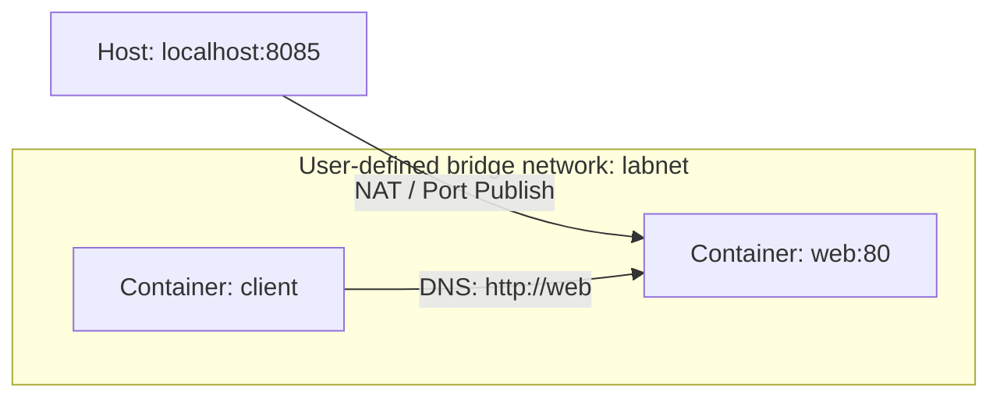
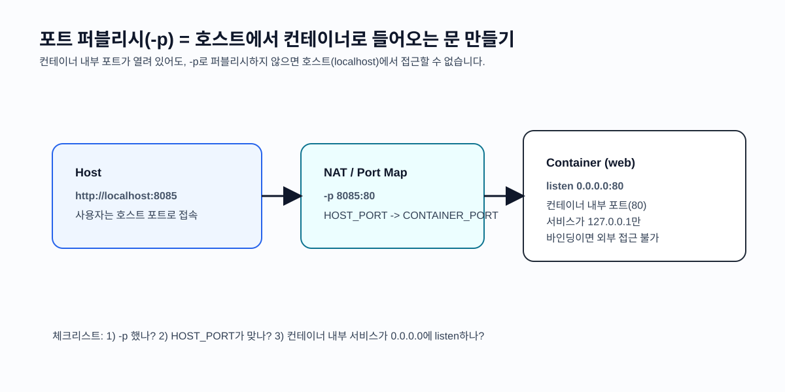
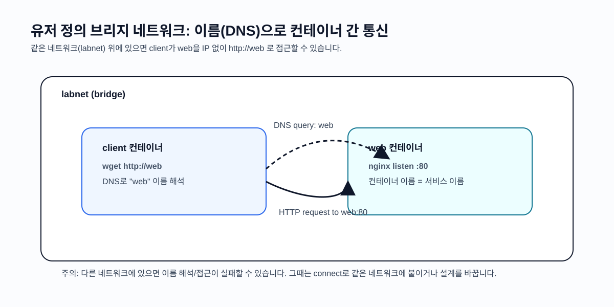
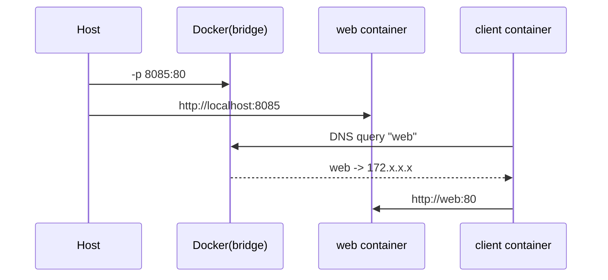

# 서비스 이해 (Service Understanding)

## 1. 배경 정보

배경 정보 보기

컨테이너는 서로 격리된 네트워크 네임스페이스를 사용하기 때문에, 아무 설정 없이 실행하면 "컨테이너 내부의 서비스"는 호스트나 다른 컨테이너에서 바로 접근할 수 없습니다. 운영/개발에서 실제로 필요한 것은 다음과 같습니다.

- 호스트(내 PC)에서 컨테이너 서비스에 접근하기(예: `-p 8080:80`)
- 컨테이너끼리 통신하기(예: 웹 컨테이너가 DB 컨테이너에 접근)
- 서비스 디스커버리(이름 기반 접근)와 네트워크 격리(필요한 것만 연결)

Docker 네트워킹은 이런 요구를 충족하기 위해 네트워크 드라이버(bridge 등), 포트 퍼블리시(NAT), DNS 기반 이름 해석(유저 정의 브리지) 등을 제공합니다. 로컬 개발에서 Docker Compose, 운영에서 Kubernetes로 확장되더라도 네트워킹의 기본 개념(포트, DNS, 서비스 간 통신, 격리)은 그대로 이어집니다.

### 인포그래픽

## 2. 핵심 개념

핵심 개념 보기

- 네트워크 드라이버(Driver): 로컬에서는 보통 `bridge`를 사용합니다. (멀티 호스트는 `overlay` 등)
- 기본 브리지 vs 유저 정의 브리지: 유저 정의 브리지 네트워크는 컨테이너 이름 기반 DNS가 제공되어 서비스 간 통신이 쉬워집니다.
- 포트 퍼블리시(Port publishing): `-p HOST_PORT:CONTAINER_PORT`로 호스트 포트를 컨테이너 포트로 매핑합니다. "컨테이너 포트가 열려 있어도" 퍼블리시하지 않으면 호스트에서 접근할 수 없습니다.
- 컨테이너 내부의 `localhost` 의미: 컨테이너 내부에서 `localhost`는 "자기 자신"입니다. 다른 컨테이너/호스트에 접근할 때는 서비스 이름(동일 네트워크) 또는 호스트 주소를 사용해야 합니다.
- 네트워크 격리/연결: 컨테이너는 여러 네트워크에 동시에 연결할 수 있고(`network connect`), 필요 최소한으로만 연결하는 것이 운영적으로 안전합니다.

### 인포그래픽

## 3. 장단점

장단점 보기

**장점**:
- 격리와 연결을 동시에 제공: 기본 격리 상태에서 필요한 연결만 열 수 있어 실수로 외부 노출되는 위험을 줄입니다.
- 이름 기반 통신(유저 정의 브리지): IP를 하드코딩하지 않고 컨테이너 이름으로 통신할 수 있어 개발/테스트 편의성이 큽니다.
- 로컬 개발 생산성: DB/캐시/웹 등 여러 서비스를 빠르게 띄우고 네트워크로 묶어 마이크로서비스 형태를 쉽게 재현할 수 있습니다.

**단점**:
- 포트/주소 혼동이 잦음: `localhost`의 의미, 호스트 포트 vs 컨테이너 포트, `-p` 누락 등으로 "안 붙는다" 문제가 자주 발생합니다.
- 운영 네트워크는 더 복잡: 로컬의 bridge 개념만으로는 부족하며(보안 그룹, L4/L7, 서비스 메시 등), 단계적으로 확장 학습이 필요합니다.

## 4. 자주 사용되는 사례

사용 사례 보기

1. 로컬 개발 환경 구성: 웹/DB/캐시를 같은 네트워크에 올려 실제 서비스 구조를 재현
2. 통신 격리: 백엔드-DB는 내부 네트워크로만 연결하고, 외부에는 웹만 포트 퍼블리시
3. 테스트/CI: 테스트 컨테이너가 대상 서비스 컨테이너에 이름 기반으로 접근하여 E2E 테스트 수행
4. 디버깅: 임시 클라이언트 컨테이너를 같은 네트워크에 붙여 요청/응답을 확인

## 5. 연관 서비스

연관 서비스 보기

- Docker Compose: 서비스 간 네트워크/이름 해석을 선언적으로 관리(로컬에서 매우 자주 사용)
- Kubernetes: Service/DNS(CoreDNS), Ingress/LoadBalancer 등으로 네트워킹을 확장
- 프록시/게이트웨이: Nginx/Traefik/Envoy 등(서비스 라우팅/리버스 프록시)
- 대안: VM 기반 네트워크 구성(브리지/포트 포워딩), 로컬 프로세스 직접 실행

## 6. 공식 문서 링크

- [Docker Docs](https://docs.docker.com/)
- [Container networking overview](https://docs.docker.com/network/)
- [docker network (CLI)](https://docs.docker.com/reference/cli/docker/network/)
- [Bridge network driver](https://docs.docker.com/network/drivers/bridge/)
- [docker run publish ports](https://docs.docker.com/reference/cli/docker/container/run/#publish-or-expose-port--p---expose)

## 7. 추가 자료

- 로컬에서 네트워크 개념이 헷갈리면 "호스트에서 접근은 `-p`", "컨테이너 간 접근은 같은 네트워크 + 이름(DNS)" 두 문장으로 정리해두면 좋습니다.
- 외부 참고(이미지/도표가 포함된 페이지)
  - Docker 네트워킹(공식): https://docs.docker.com/network/
  - Bridge driver(공식): https://docs.docker.com/network/drivers/bridge/
