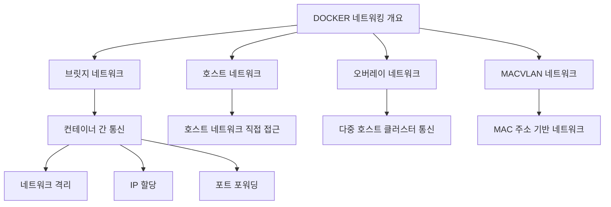
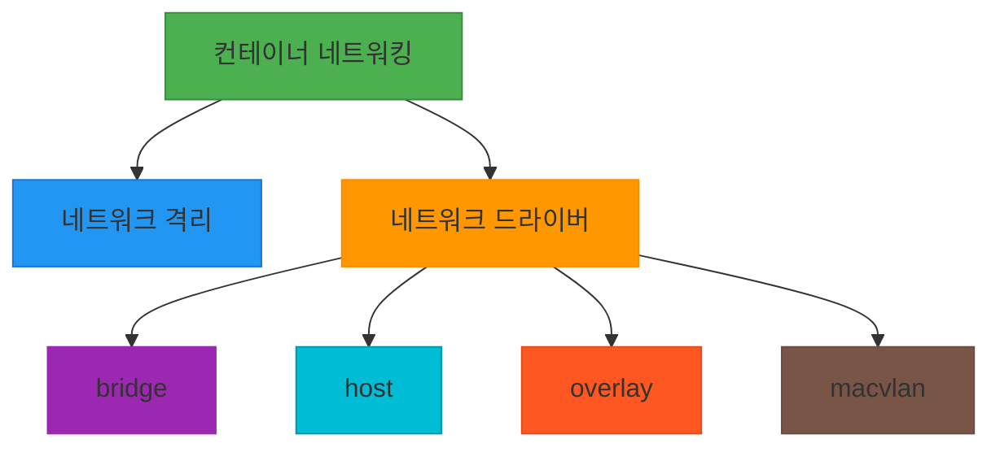

# 서비스 이해 (Service Understanding)

## 1. 배경 정보

배경 정보 보기

Docker Networking은 컨테이너 간 통신을 관리하고 네트워크를 구성하는 기능입니다. Docker는 기본적으로 bridge 네트워크를 사용하여 컨테이너를 연결하고, host, overlay, macvlan 등의 네트워크 드라이버를 지원합니다. 컨테이너는 호스트 네트워크나 고유의 가상 네트워크를 통해 상호작용하며, 이는 마이크로서비스 아키텍처나 다중 컨테이너 애플리케이션에서 필수적인 기능입니다. Docker 네트워킹은 네트워크 격리, IP 할당, 포트 포워딩 등 다양한 기능을 제공합니다.

### 인포그래픽

**참고 이미지**:
- [이미지 보기](https://docs.docker.com/engine/networking/images/docker-networking-diagram.png)
- [이미지 보기](https://docs.example.com/image1.png)

## 2. 핵심 개념

핵심 개념 보기

- Container Networking: 컨테이너 간 통신을 위한 네트워크 인프라
- Network Isolation: 컨테이너 간 격리 및 보안 강화
- Network Drivers: bridge, host, overlay, macvlan 등 네트워크 드라이버

### 인포그래픽

**참고 이미지**:
- [이미지 보기](https://docs.example.com/image1.png)
- [이미지 보기](https://docs.example.com/image2.png)
- [이미지 보기](https://docs.example.com/image3.png)

## 3. 장단점

장단점 보기

**장점**:
- 간편한 네트워크 구성 및 컨테이너 연결
- 다양한 네트워크 드라이버로 유연한 환경 설정 가능
- 호스트 네트워크 모드로 빠른 통신이 가능

**단점**:
- 고급 네트워크 설정 시 복잡도 증가
- 잘못된 구성 시 네트워크 장애 발생 가능성

## 4. 자주 사용되는 사례

사용 사례 보기

1. 마이크로서비스 아키텍처에서 서비스 간 통신 구성
2. CI/CD 파이프라인에서 빌드 서버와 테스트 서버 연결
3. 클라우드 환경에서 컨테이너 클러스터 통신 최적화

## 5. 연관 서비스

연관 서비스 보기

- Docker Compose
- Docker Swarm
- Kubernetes

## 6. 공식 문서 링크

- [Docker Networking 공식 문서](https://docs.docker.com/network/)
- [Docker Compose 네트워크 설정 가이드](https://docs.docker.com/compose/networking/)

