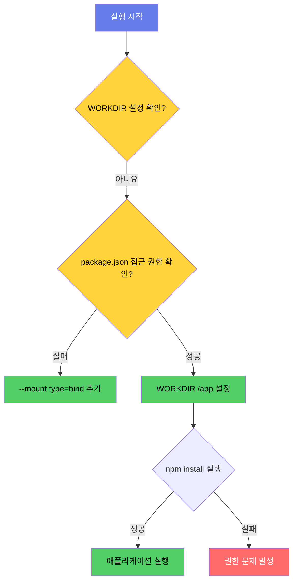
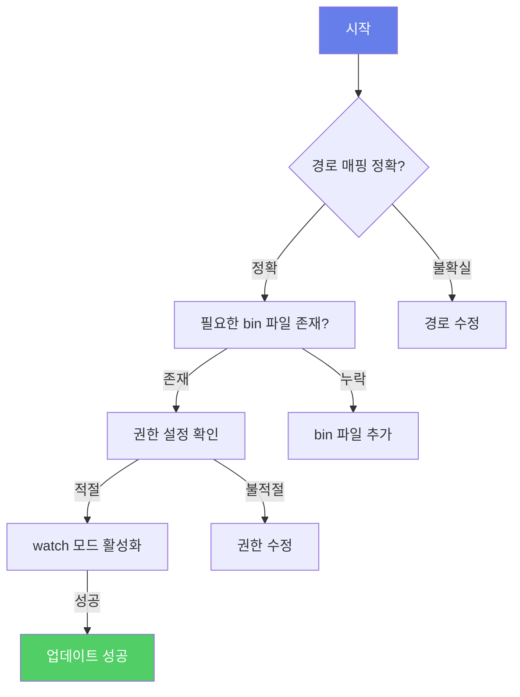

# 📘 Week 2 - Day 1

  <a href="service_understanding.md" style="color: white; text-decoration: none; padding: 8px 16px; background: rgba(255,255,255,0.2); border-radius: 5px; font-weight: bold;">⬅️ 이전: 📚 서비스 이해</a>
  <a href="../README.md" style="color: white; text-decoration: none; padding: 8px 16px; background: rgba(255,255,255,0.3); border-radius: 5px; font-weight: bold;">🏠 목차</a>
  <a href="handson_step1.md" style="color: white; text-decoration: none; padding: 8px 16px; background: rgba(255,255,255,0.2); border-radius: 5px; font-weight: bold;">다음: 🛠️ Hands-on Lab - Step 1 ➡️</a>

---

# Deep Dive - 트러블슈팅

## 🔍 시나리오 1: npm install 실패 시나리오

### 트러블슈팅 흐름도

### 🔍 시나리오 설명

Docker 컨테이너가 실행 시 npm install이 실패하고 애플리케이션이 시작되지 않는 문제

### 🔬 원인 분석

WORKDIR 설정 누락 또는 권한 문제로 package.json이 실행 디렉토리에서 접근 불가

### 🔎 원인 확인 방법

docker logs <container-id> 명령어로 컨테이너 로그 확인

docker inspect <container-id> | grep -i workingdir 명령어로 WORKDIR 설정 확인

docker exec -it <container-id> ls -l /app 명령어로 디렉토리 권한 점검

### 🔧 수정 방법

Dockerfile에 WORKDIR /app 추가: WORKDIR /app

COPY --chown=node:node package.json . 명령어로 권한 설정

docker build --no-cache -t myapp . 명령어로 이미지 재빌드

### ✔️ 정상 확인 방법

docker run -d --name myapp myapp 명령어로 컨테이너 실행

docker logs -f myapp 명령어로 npm install 로그 확인

npm install --dry-run 명령어로 로컬 환경에서 설치 가능성 검증

---

## 🔍 시나리오 2: watch 모드 동기화 실패 시나리오

### 트러블슈팅 흐름도

### 🔍 시나리오 설명

Docker Compose의 watch 모드가 파일 변경을 감지하지 못해 애플리케이션 업데이트가 이루어지지 않는 문제

### 🔬 원인 분석

watch 블록의 경로 매핑 오류 또는 필요한 bin 파일 누락

### 🔎 원인 확인 방법

docker-compose config 명령어로 서비스 정의 검증

docker inspect <container-id> | grep -i mountpoint 명령어로 마운트 포인트 확인

docker exec -it <container-id> which stat 명령어로 stat 실행 파일 존재 여부 확인

### 🔧 수정 방법

docker-compose.yml에서 watch 블록 수정: 
  watch:
    - action: sync
      path: ./web
      target: /app/web
    - action: sync+restart
      path: ./proxy/nginx.conf
      target: /etc/nginx/conf.d/default.conf

RUN apk add --no-cache coreutils 명령어로 stat/mkdir/rmdir 설치

docker-compose up --build 명령어로 구성 재빌드

### ✔️ 정상 확인 방법

docker-compose exec web touch /app/web/test.txt 명령어로 파일 생성 테스트

docker-compose logs -f web 명령어로 동기화 로그 확인

docker-compose exec web ls -l /app/web 명령어로 마운트 상태 검증

---

  <h3 style="margin: 0 0 10px 0;">🎓 Week 2 - Day 1 학습 완료!</h3>
  
다음 단계로 계속 진행하세요

  <a href="service_understanding.md" style="color: white; text-decoration: none; padding: 10px 20px; background: rgba(255,255,255,0.2); border-radius: 5px; font-weight: bold; font-size: 14px;">⬅️ 이전 📚 서비스 이해</a>
  <a href="../README.md" style="color: white; text-decoration: none; padding: 10px 20px; background: rgba(255,255,255,0.3); border-radius: 5px; font-weight: bold; font-size: 14px;">🏠 목차로</a>
  <a href="handson_step1.md" style="color: white; text-decoration: none; padding: 10px 20px; background: rgba(255,255,255,0.2); border-radius: 5px; font-weight: bold; font-size: 14px;">다음 ➡️ 🛠️ Hands-on Lab - Step 1</a>

---

  
💡 <strong>Tip:</strong> 실습 중 문제가 발생하면 공식 문서를 참고하세요

  
📅 Week 2 Day 1 | 🎯 DevOps 6개월 교육과정

