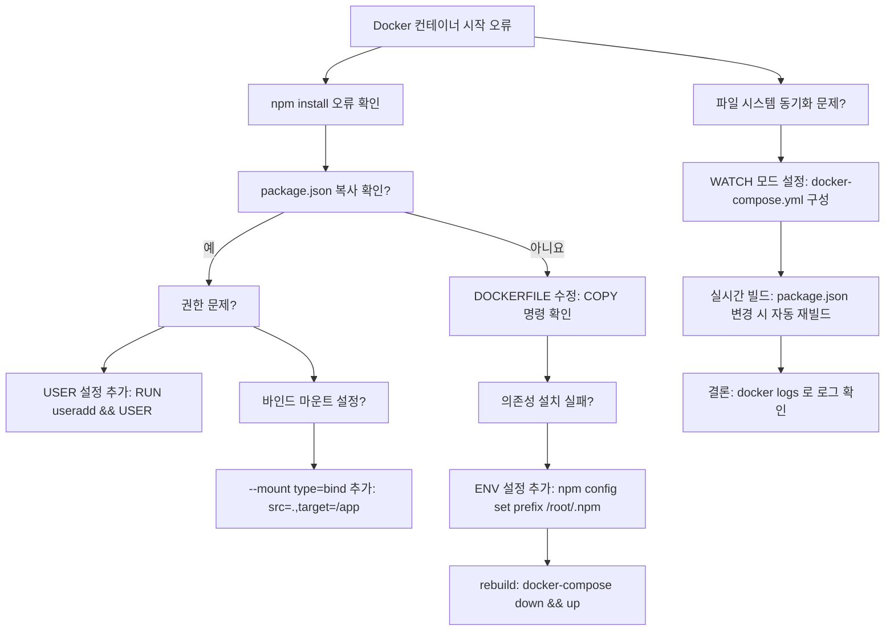
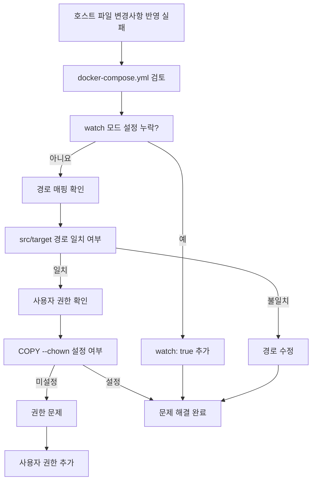

# Deep Dive - 트러블슈팅

## 시나리오 1: npm install 실패로 인한 컨테이너 시작 실패

### 트러블슈팅 흐름도

**참고 이미지**:
- [이미지 보기](https://docs.example.com/image1.png)

### 시나리오 설명

문제 상황 보기

Docker 컨테이너가 시작되지 않거나 npm install 과정에서 오류가 발생합니다. 로그에서 'npm ERR!' 메시지가 나타납니다.

### 원인 분석

원인 분석 보기

Dockerfile에서 package.json이 정확히 복사되지 않거나, 의존성 설치 권한이 부족합니다. 또는 호스트와 컨테이너의 파일 시스템 동기화 문제가 있습니다.

### 원인 확인 방법

진단 단계 보기

docker build --no-cache -t myapp . 명령어로 빌드 로그 확인

docker logs <container-id> 명령어로 실시간 로그 확인

Dockerfile에서 COPY 명령어가 package.json을 올바르게 복사하는지 확인

npm install 실행 시 권한 문제 여부 확인 (RUN npm install 명령어 확인)

호스트와 컨테이너의 파일 시스템 동기화 설정이 제대로 적용되었는지 docker-compose.yml 확인

### 수정 방법

해결 단계 보기

Dockerfile에서 WORKDIR /app 설정 후 COPY package.json . 명령어로 파일 복사

npm install 실행 시 권한 문제 해결을 위해 USER 명령어로 루(root) 사용 (예: USER root)

docker-compose.yml에서 volumes: - .:/app:z 설정으로 SELinux 문제 해결

docker build --no-cache -t myapp . 명령어로 다시 빌드

docker run -d --name myapp myapp 명령어로 컨테이너 재시작

### 정상 확인 방법

검증 단계 보기

docker logs -f <container-id> 명령어로 npm install 완료 여부 확인

npm run dev 명령어로 개발 서버 실행 시 nodemon 로그 확인

src/index.js 파일 수정 후 변경 사항이 컨테이너에 반영되는지 확인

docker ps 명령어로 컨테이너 상태 확인

docker stats 명령어로 리소스 사용량 정상 여부 확인

---

## 시나리오 2: bind mount 파일 변경 시 동기화 실패

### 트러블슈팅 흐름도

**참고 이미지**:
- [이미지 보기](https://docs.docker.com/compose/reference/options/#watch)

### 시나리오 설명

문제 상황 보기

호스트 파일을 컨테이너에 bind mount했지만, 변경된 파일이 컨테이너에 반영되지 않습니다. docker-compose watch 모드가 작동하지 않습니다.

### 원인 분석

원인 분석 보기

docker-compose.yml에서 watch 모드 설정이 누락되었거나, 경로 매핑이 잘못되었으며, 컨테이너 사용자 권한이 파일 쓰기 권한이 없습니다.

### 원인 확인 방법

진단 단계 보기

docker-compose.yml 파일에서 volumes 섹션 확인 (type: bind, source, target 설정)

docker-compose watch 모드 설정이 있는지 확인 (action: sync 또는 sync+restart)

docker-compose up --build 명령어로 서비스 실행 후 로그 확인

호스트 파일 변경 후 docker logs -f <container-id> 명령어로 컨테이너 로그 확인

컨테이너 내 파일 권한 확인 (ls -l /app 경로 확인)

### 수정 방법

해결 단계 보기

docker-compose.yml에서 volumes: - .:/app:z 설정으로 SELinux 문제 해결

docker-compose.yml에 watch: - action: sync+restart, path: ./src, target: /app/src 추가

Dockerfile에서 COPY --chown=app:app package.json . 명령어로 파일 소유자 설정

docker-compose down && docker-compose up --build 명령어로 서비스 재구성

docker-compose restart <service-name> 명령어로 서비스 재시작

### 정상 확인 방법

검증 단계 보기

src/App.jsx 파일 수정 후 docker logs -f <container-id> 명령어로 변경 사항 확인

docker-compose ps 명령어로 서비스 상태 확인

docker-compose top 명령어로 포트 맵핑 확인

docker inspect <container-id> 명령어로 volume 설정 확인

npm run dev 명령어로 개발 서버 실행 시 변경된 파일 반영 여부 확인

---

