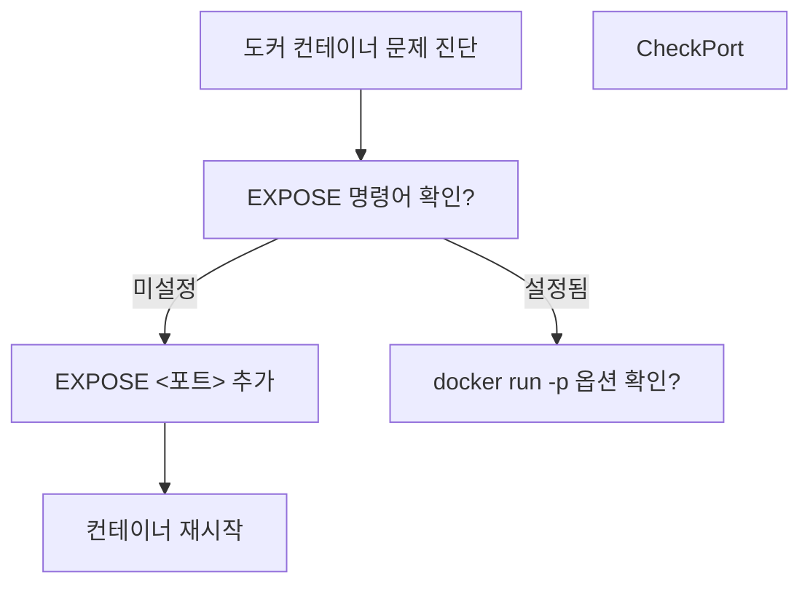

# Deep Dive - 트러블슈팅

## 시나리오 1: 포트 매핑 누락으로 인한 서비스 접근 실패

### 트러블슈팅 흐름도

```mermaid
graph TD
  Start[도커 컨테이너 문제 진단] --> CheckExpose[EXPOSE 명령어 확인?]
  CheckExpose -->|미설정| AddExpose[EXPOSE <포트> 추가]
  AddExpose --> Restart[컨테이너 재시작]
  CheckExpose -->|설정됨| CheckPortMap[docker run -p 옵션 확인?]
  CheckPort
```