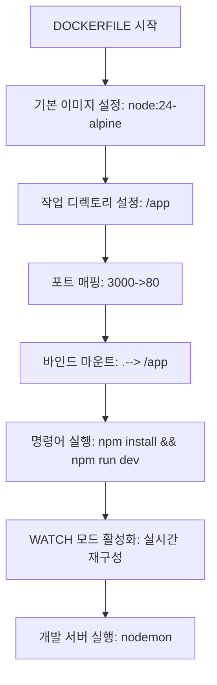

# 서비스 이해 (Service Understanding)

## 1. 배경 정보

<details>
<summary>배경 정보 보기</summary>

Dockerfile은 컨테이너 이미지를 만들기 위한 레시피 같은 파일입니다. 예를 들어, `node:24-alpine`이라는 기본 이미지를 사용해 코드를 실행하고, 코드가 변경되면 자동으로 재구성하는 기능이 있습니다. 이 과정에서 `npm install`로 의존성을 설치하고 `npm run dev`로 개발 서버를 실행합니다.

### 인포그래픽



**용어 정의**:
- **바인드 마운트**: 호스트 컴퓨터의 파일과 컨테이너의 파일을 실시간으로 연결하는 기능 (예: USB 드라이브 연결)
- **WATCH 모드**: 파일이 변경되면 자동으로 컨테이너 재시작하는 기능 (예: 텍스트 에디터에서 파일 수정 시 자동 저장)

**참고 이미지**:
- [기본 이미지 설정](https://docs.docker.com/engine/reference/builder/#from)
- [바인드 마운트](https://docs.docker.com/engine/reference/run/#mounts)
- [빌드 명령어](https://docs.docker.com/engine/reference/commandline/build/)

</details>

## 2. 핵심 개념

<details>
<summary>핵심 개념 보기</summary>

- **Dockerfile 구조**: 기본 이미지, 작업 디렉토리, 명령어, 바인드 마운트 정의
- **바인드 마운트**: 호스트 디렉토리와 컨테이너 디렉토리 간 데이터 동기화
- **WATCH 모드**: 파일 변경 시 자동 재빌드 및 컨테이너 재시작
- **빌드 타임 vs 런타임 구성**: 이미지 생성 시 설정 (빌드 타임) vs 실행 시 설정 (런타임)

### 인포그래픽

```mermaid
graph TD
  Start[DOCKERFILE 개념 구조] --> CONCEPT1[기본 이미지(예: node:24-alpine)]
  START --> CONCEPT2[작업 디렉토리 설정]
  START --> CONCEPT3[바인드 마운트]
  START --> CONCEPT4[빌드 타임 vs 런타임]
  CONCEPT3 --> SUBCONCEPT1[호스트 디렉토리 --> 컨테이너 디렉토리]
  CONCEPT3 --> SUBCONCEPT2[--mount type=bind 파라미터]
  CONCEPT4 --> SUBCONCEPT3[빌드 타임: 이미지 생성 시 설정]
  CONCEPT4 --> SUBCONCEPT4[런타임: 실행 시 설정]
  CONCEPT1 --> EXAMPLE1[sh -c "npm install && npm run dev"]
  CONCEPT3 --> EXAMPLE2[./web/App.jsx --> /src/web/App.jsx]
  CONCEPT3 --> EXAMPLE3[COPY --chown 사용 패턴]
  CONCEPT3 --> EXAMPLE4[ssh mount: git@github.com:me/myprivaterepo.git]
  CONCEPT3 --> EXAMPLE5[aws-secret-key 환경 변수 매핑]
  CONCEPT3 --> EXAMPLE6[watch 모드 동작: sync/sync+restart]
  CONCEPT6[WATCH 모드] --> ACTION1[sync: 파일 변경 시 실시간 동기화]
  CONCEPT6 --> ACTION2[sync+restart: 파일 변경 시 재빌드 및 재시작]
  CONCEPT6 --> PATH1[./web --> /app/web]
  CONCEPT6 --> PATH2[./proxy/nginx.conf --> /etc/nginx/conf.d/default.conf]
  CONCEPT6 --> RULE1[ignore: node_modules/ 제외]
  CONCEPT6 --> RULE2[package.json 변경 시 전체 재빌드]
  CONCEPT6 --> RULE3[requirements.txt 변경 시 재빌드]
  CONCEPT6 --> TOOL1[stat, mkdir, rmdir, watch 실행 필요]
  CONCEPT6 --> TOOL2[USER 권한: 타겟 경로 쓰기 가능]
  CONCEPT6 --> TOOL3[DOCKERFILE COPY 명령어 사용]
  End[완료]
```

**용어 정의**:
- **빌드 타임**: 이미지 생성 시 설정 (예: `npm install`)
- **런타임**: 컨테이너 실행 시 설정 (예: `npm run dev`)

**비유**:
- **바인드 마운트**: USB 드라이브 연결 (호스트 파일 ↔ 컨테이너 파일 실시간 동기화)
- **Dockerfile 최적화**: 건물 설계 최적화 (층 수 줄이기, 자원 효율화)

**참고 이미지**:
- [바인드 마운트](https://docs.docker.com/advanced/containers/bind-mounts/)
- [SSH 마운트](https://docs.docker.com/engine/reference/commandline/buildx/#ssh)
- [USER 권한](https://docs.docker.com/engine/reference/builder/#user)
- [COPY 명령어](https://docs.docker.com/engine/reference/builder/#copy)

</details>

## 3. 장단점

<details>
<summary>장단점 보기</summary>

**장점**:
- **환경 일관성**: 개발/생산 환경에서 동일한 설정으로 일관된 실행 환경 제공 (예: 개발 환경에서 테스트 환경으로 바로 옮길 수 있음)
- **자동화**: 빌드 프로세스 자동화로 개발 생산성 향상 (예: `npm install` 자동 실행)
- **실시간 동기화**: `watch` 모드로 코드 변경 시 즉시 컨테이너 재구성 (예: 텍스트 에디터에서 파일 수정 시 자동 저장)

**단점**:
- **보안 리스크**: 바인드 마운트로 호스트 파일 시스템에 대한 접근 권한 부여 (예: `./src` 디렉토리에 있는 파일이 공격자에게 노출될 수 있음)
- **복잡도**: 다중 컨테이너 환경에서 네트워크/볼륨 설정 관리 어려움 (예: 10개 이상의 컨테이너를 함께 운영할 때 설정 관리 복잡)

</details>

## 4. 자주 사용되는 사례

<details>
<summary>사용 사례 보기</summary>

1. **React 애플리케이션 개발**: `src/` 디렉토리 변경 시 자동 재빌드 (예: 코드 수정 후 `npm run dev` 자동 실행)
2. **Node.js 백엔드 서버**: `npm run dev`로 실시간 코드 변경 반영 (예: 개발 중 변경된 코드를 바로 테스트 가능)
3. **CI/CD 파이프라인**: `package.json` 수정 시 이미지 재빌드 자동화 (예: GitHub Actions에서 코드 변경 시 자동 빌드)

</details>

## 5. 연관 서비스

<details>
<summary>연관 서비스 보기</summary>

- **Docker Compose**: 여러 컨테이너를 함께 관리하는 도구 (예: 프론트엔드, 백엔드, 데이터베이스 컨테이너를 한 번에 실행)
- **Docker Buildx**: 고급 빌드 기능 제공 (예: SSH 마운트로 프라이빗 리포지토리 접근)
- **AWS Secrets Manager**: 보안 정보 관리 (예: `aws-secret-key` 환경 변수로 비밀번호 관리)

</details>

## 6. 공식 문서 링크

- [Dockerfile Reference](https://docs.docker.com/engine/reference/builder/)
- [Docker Compose Documentation](https://docs.docker.com/compose/)
- [Docker Buildx Guide](https://docs.docker.com/buildx/)