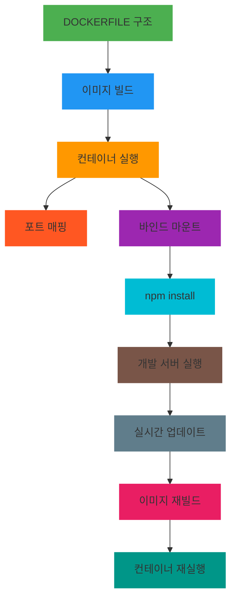
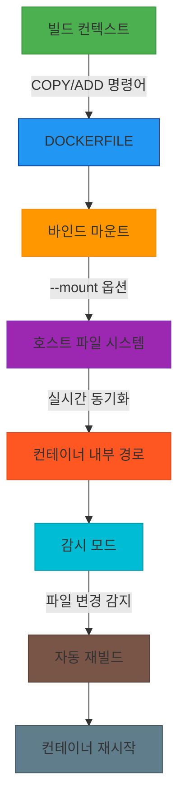

# 서비스 이해 (Service Understanding)

## 1. 배경 정보

배경 정보 보기

Dockerfile은 컨테이너 이미지의 빌드 프로세스를 정의하는 텍스트 파일로, 애플리케이션을 실행할 수 있는 가상 환경을 구성합니다. 명령어와 설정을 통해 호스트와 컨테이너 간의 파일 시스템 매핑, 포트 연결, 의존성 설치 등을 자동화하여 개발 및 배포 효율성을 높입니다.

### 인포그래픽

## 2. 핵심 개념

핵심 개념 보기

- Build Context (빌드 컨텍스트): Dockerfile에서 COPY 또는 ADD 명령어로 파일을 복사할 때 사용하는 디렉토리 구조
- Bind Mount (바인드 마운트): 호스트 파일 시스템을 컨테이너 내부 경로에 실시간으로 마운트하여 변경 사항을 즉시 반영
- Watch Mode (감시 모드): 파일 변경 감지 기능으로 개발 중인 소스 코드 수정 시 자동 재빌드 및 컨테이너 재시작을 지원

### 인포그래픽

**참고 이미지**:
- [이미지 보기](https://docs.example.com/image1.png)
- [이미지 보기](https://docs.example.com/image2.png)
- [이미지 보기](https://docs.example.com/image3.png)
- [이미지 보기](https://docs.example.com/image4.png)
- [이미지 보기](https://docs.example.com/image5.png)

## 3. 장단점

장단점 보기

**장점**:
- 개발 환경과 배포 환경의 일관성을 유지하여 버그 발생을 방지
- 자동화된 빌드 프로세스로 CI/CD 파이프라인 통합이 용이
- 포트 맵핑 및 의존성 관리로 빠른 테스트 환경 구축 가능

**단점**:
- 대규모 애플리케이션에서는 Dockerfile의 복잡도가 관리 어려움
- 바인드 마운트 시 SELinux/ AppArmor 정책으로 인한 접근 제한 발생 가능성

## 4. 자주 사용되는 사례

사용 사례 보기

1. Node.js 개발 서버에서 실시간 코드 변경 감지 및 재시작
2. Python Flask 애플리케이션의 소스 코드 동기화 및 의존성 관리
3. GitHub 개인 저장소 클론을 위한 SSH 마운트 설정

## 5. 연관 서비스

연관 서비스 보기

- Docker Compose (컨테이너 오케스트레이션)
- Docker Buildx (고급 빌드 기능)
- Kubernetes (컨테이너 오케스트레이션 플랫폼)

## 6. 공식 문서 링크

- [Dockerfile Reference](https://docs.docker.com/engine/reference/builder/)
- [Bind Mounts Documentation](https://docs.docker.com/storage/bind-mounts/)
- [공식 문서](https://docs.docker.com/engine/reference/commandline/build/)

