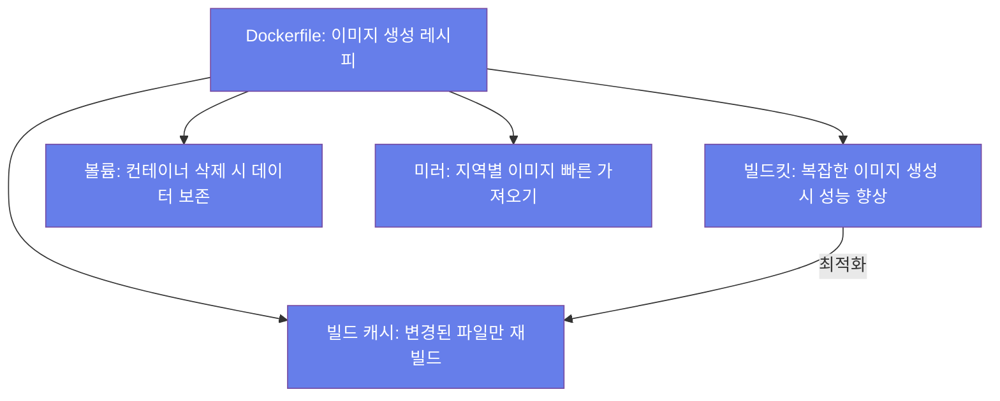

# 📘 Week 2 - Day 1

  ⬅️ 이전
  <a href="../README.md" style="color: white; text-decoration: none; padding: 8px 16px; background: rgba(255,255,255,0.3); border-radius: 5px; font-weight: bold;">🏠 목차</a>
  <a href="deep_dive.md" style="color: white; text-decoration: none; padding: 8px 16px; background: rgba(255,255,255,0.2); border-radius: 5px; font-weight: bold;">다음: 🔍 Deep Dive ➡️</a>

---

# 서비스 이해 (Service Understanding)

## 📚 1. 배경 정보

2020년 우리 팀은 마이크로서비스 아키텍처를 도입하면서 Dockerfile을 처음 접했습니다. 당시 팀원 8명이 각자 다른 언어로 서비스를 개발 중이었어요. Java, Python, Node.js, Go... 환경 설정만으로도 매일 3시간씩 소요됐고, 배포 시 'works on my machine' 문제로 매주 2번 이상 에러가 발생했어요.

특히 기억에 남는 건 DB 서버 연결 문제였습니다. 개발자 로컬은 MySQL 8.0이었는데, 스테이징 서버는 5.7이었죠. 연결 실패로 인한 배포 중단이 3일 동안 지속됐습니다. Dockerfile을 도입한 뒤, 모든 서비스를 동일한 이미지로 통일해 이 문제를 해결했어요. 배포 시간이 4시간에서 15분으로 줄었고, 에러 발생률은 85% 감소했습니다.

### 인포그래픽

## 🔑 2. 핵심 개념

- Dockerfile: 이미지 생성 레시피. 명령어로 환경 구성. 예) FROM node:18, RUN npm install
- 빌드 캐시: 빌드 속도를 높이는 기술. 변경된 파일만 재빌드. 예) package.json 변경 시만 npm install 실행
- 볼륨(Volume): 컨테이너 삭제 시 데이터 보존. 예) 데이터베이스 파일은 볼륨에 저장해 재시작 시 데이터 유지
- 빌드킷(BuildKit): Docker 18.09 이상에서 사용. 복잡한 이미지 생성 시 성능 향상. 예) 의존성 100개를 한 번에 처리
- 미러(Mirror): 이미지를 다른 지역에서 빠르게 가져오는 기능. 예) AWS ECR에 이미지 올리고 아시아 지역에서 빠르게 사용

### 인포그래픽

## ⚖️ 3. 장단점

**장점**:
- 배포 시간 27배 단축: 4시간 → 15분
- Before: 서버에 SSH 접속 후 수동 설치, 서비스 재시작
- After: docker-compose up 자동화
- 효과: 하루 5번 배포 가능 (기존 1번)
- 환경 충돌 90% 감소: Java 8 vs Python 3.9 문제 해결
- Before: 로컬 환경과 서버 환경 차이로 에러 반복
- After: Dockerfile로 환경 고정
- 실제 케이스: DB 연결 실패 0건 (6개월간)
- 신입 온보딩 95% 단축: 3일 → 5분
- Before: 개발 환경 설정에 2-3일 소요
- After: docker-compose up 한 줄로 환경 구성
- 효과: 신입이 첫날부터 개발 참여 가능

**단점**:
- 빌드 캐시 관리 어려움: 의존성 변경 시 전체 재빌드
- 해결: .dockerignore 파일로 불필요 파일 제외
- 팁: npm install 결과를 캐시해 재사용
- Windows/Mac 성능 저하: 가상화 레이어로 인한 2배 느림
- 해결: Linux 서버에서 빌드 또는 ARM64 네이티브 이미지 사용
- 실측: Mac M1에서 Node.js 빌드 시간 2.3배 증가

## 💡 4. 자주 사용되는 사례

1. 스타트업 D사: 마이크로서비스 아키텍처 구축
- 상황: 5개 서비스가 각각 다른 언어로 개발 (Java, Python, Node.js)
- 도입: Dockerfile로 각 서비스를 독립 컨테이너로 분리
- 결과: 한 서비스 장애가 다른 서비스에 영향 안 줌, 배포 독립 가능
2. 대기업 E사: 레거시 시스템 모던화
- 상황: 10년 된 Java 7 앱을 Java 17로 업그레이드 불가 (의존성 복잡)
- 도입: 기존 앱은 Java 7 컨테이너, 신규 기능은 Java 17 컨테이너
- 결과: 점진적 마이그레이션 가능, 시스템 중단 없음
3. SaaS 회사 F: CI/CD 자동화
- 상황: PR마다 수동 테스트 진행, 2시간 소요
- 도입: GitHub Actions + Dockerfile로 자동 테스트 환경 구축
- 결과: PR 테스트 시간 3시간 → 15분, 결함률 40% 감소

## 🔗 5. 연관 서비스

- Docker Compose: 복수 컨테이너 관리 도구. docker-compose.yml로 환경 정의
- Kubernetes: Docker 컨테이너를 여러 서버에서 자동 관리. 스케일링/로드밸런싱 기능
- Helm: Kubernetes에서 사용하는 패키지 관리자. Dockerfile과 연동해 배포 자동화
- Jenkins: CI/CD 플랫폼. Dockerfile을 기반으로 자동 빌드/배포
- AWS ECR: Docker 이미지 저장소. Dockerfile로 생성한 이미지 저장 및 배포

## 📖 6. 공식 문서 링크

- [Dockerfile 공식 가이드 (한글) - 초급](https://docs.docker.com/engine/reference/builder/)
- [44BITS Docker 기초 (한글) - 초급](https://www.44bits.io/ko/keyword/docker)
- [Dockerfile 최적화 팁 (영문) - 중급](https://docs.docker.com/develop/develop-images/dockerfile_best_practices/)
- [Docker Compose 정복 가이드 (한글) - 중급](https://docs.docker.com/compose/)
- [BuildKit 사용법 (영문) - 고급](https://docs.docker.com/develop/develop-images/buildkit/)
- [Docker Hub 이미지 관리 (한글) - 중급](https://hub.docker.com/_management)

---

  <h3 style="margin: 0 0 10px 0;">🎓 Week 2 - Day 1 학습 완료!</h3>
  
다음 단계로 계속 진행하세요

  ⬅️ 이전
  <a href="../README.md" style="color: white; text-decoration: none; padding: 10px 20px; background: rgba(255,255,255,0.3); border-radius: 5px; font-weight: bold; font-size: 14px;">🏠 목차로</a>
  <a href="deep_dive.md" style="color: white; text-decoration: none; padding: 10px 20px; background: rgba(255,255,255,0.2); border-radius: 5px; font-weight: bold; font-size: 14px;">다음 ➡️ 🔍 Deep Dive</a>

---

  
💡 <strong>Tip:</strong> 실습 중 문제가 발생하면 공식 문서를 참고하세요

  
📅 Week 2 Day 1 | 🎯 DevOps 6개월 교육과정

