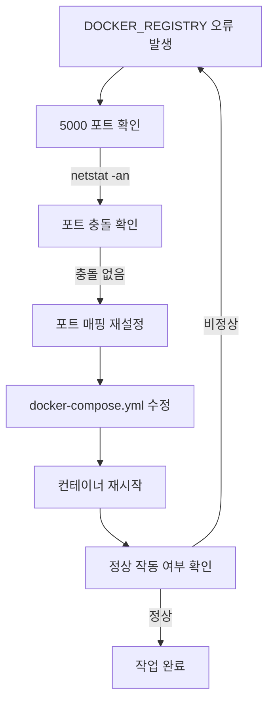
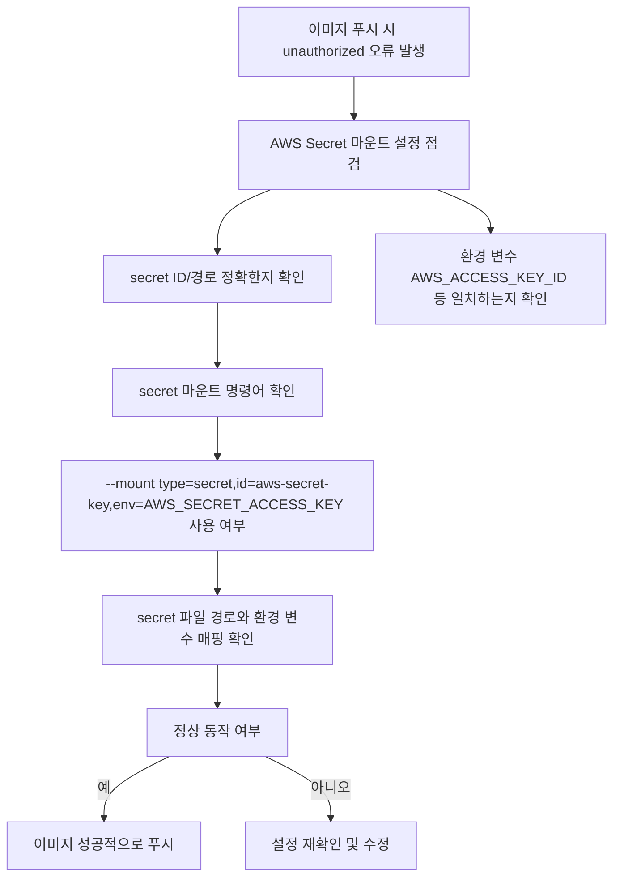

# Deep Dive - 트러블슈팅

## 시나리오 1: Docker Registry 포트 충돌로 인한 서비스 시작 실패

### 트러블슈팅 흐름도

**참고 이미지**:
- [이미지 보기](https://docs.example.com/image1.png)
- [이미지 보기](https://docs.example.com/image2.png)

### 시나리오 설명

문제 상황 보기

Docker Registry 컨테이너가 시작되지 않거나 'Address already in use' 오류 발생

### 원인 분석

원인 분석 보기

5000 포트가 이미 사용 중이거나 포트 매핑 설정이 잘못됨

### 원인 확인 방법

진단 단계 보기

docker ps -a | grep registry로 컨테이너 상태 확인

lsof -i :5000 또는 netstat -tuln | grep 5000로 포트 사용 여부 확인

docker inspect <container-id>로 네트워크 설정 검토

docker logs <container-id>로 컨테이너 로그 확인

### 수정 방법

해결 단계 보기

kill -9 $(lsof -t -i:5000)으로 충돌 프로세스 강제 종료

docker run -d -p 5000:5000 --name registry registry:2 명령어로 포트 재할당

docker-compose up --build로 구성 파일 재빌드

docker system prune -a로 이전 컨테이너 및 이미지 정리

### 정상 확인 방법

검증 단계 보기

curl http://localhost:5000/v2/_catalog로 API 테스트

docker push localhost:5000/test-image로 이미지 푸시 테스트

docker inspect <container-id>로 포트 매핑 재확인

---

## 시나리오 2: Docker Registry 인증 실패: AWS Secret Mount 오류

### 트러블슈팅 흐름도

**참고 이미지**:
- [이미지 보기](https://docs.docker.com/registry/troubleshoot/#authentication)
- [이미지 보기](https://docs.docker.com/engine/reference/run/#mounts)
- [이미지 보기](https://docs.aws.amazon.com/AmazonEC2/latest/userguide/secret-manager.html)

### 시나리오 설명

문제 상황 보기

AWS Secret을 마운트한 후 이미지 푸시 시 'unauthorized' 오류 발생

### 원인 분석

원인 분석 보기

secret 마운트 설정이 잘못되었거나 환경 변수와 파일 경로 불일치

### 원인 확인 방법

진단 단계 보기

docker inspect <container-id>로 volume 마운트 경로 확인

ls /var/run/secrets/aws/로 secret 파일 존재 여부 확인

docker logs <container-id>로 인증 관련 로그 확인

aws s3 ls s3://test-bucket로 S3 접근 권한 검증

### 수정 방법

해결 단계 보기

docker run -d -p 5000:5000 --mount type=secret,src=aws-key-id,target=/var/run/secrets/aws/aws-key-id --mount type=secret,src=aws-secret-key,target=/var/run/secrets/aws/aws-secret-key --name registry registry:2 명령어로 secret 재마운트

docker-compose --env-file .env up --build로 환경 변수 재등록

chmod 600 /var/run/secrets/aws/*.key로 secret 파일 권한 설정

docker system prune -a로 이전 컨테이너 정리

### 정상 확인 방법

검증 단계 보기

aws s3 cp s3://test-bucket/test.txt .로 S3 접근 테스트

docker push localhost:5000/test-image로 이미지 푸시 재시도

docker inspect <container-id>로 secret 마운트 경로 재확인

---

