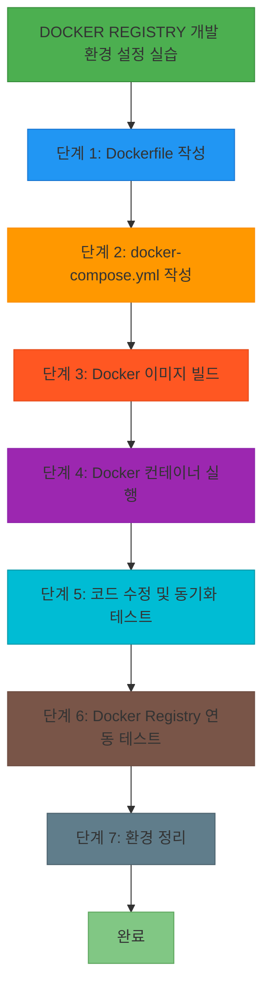

# Hands-on Lab - Step 1

## 실습 개요

**제목**: Docker Registry 개발 환경 설정 실습

**목적**: Docker Registry 서비스를 사용하여 개발 환경을 구성하고 실시간 코드 동기화 기능을 활용하는 방법을 학습합니다.

**학습 목표**:
- Docker Registry 서비스를 로컬 환경에서 실행하는 방법을 익힘
- 볼륨 마운트를 통한 실시간 코드 동기화를 구현하는 방법을 학습
- Docker Compose를 사용한 개발 환경 설정을 이해하고 적용

**예상 소요 시간**: 45분

**난이도**: Beginner

### 실습 흐름도



**참고 이미지**:
- [이미지 보기](https://docs.example.com/image1.png)


## 사전 요구사항

<details>
<summary>사전 요구사항 보기</summary>

- Docker Desktop 설치 및 실행 중인 환경
- Node.js 18 이상 및 NPM 설치
- docker-compose CLI 설치

</details>

## 환경 설정

<details>
<summary>환경 설정 보기</summary>

프로젝트 디렉토리에 Dockerfile 및 docker-compose.yml 파일 생성

node_modules 폴더를 .dockerignore 파일에 배제하여 빌드 최적화

</details>

---

## Step 1: Dockerfile 작성

**목표**: Node.js 환경을 위한 Dockerfile 작성

**명령어**:
<details>
<summary>명령어 보기</summary>

```bash
# 기본 이미지 설정
FROM node:20-alpine
# 작업 디렉토리 설정
WORKDIR /app
# 의존성 설치 명령어 설정
CMD ["sh", "-c", "npm install && npm run dev"]
```

</details>

**예상 출력**:
<details>
<summary>예상 출력 보기</summary>

```
Dockerfile 파일 생성 완료
```

</details>

**확인 방법**:
<details>
<summary>확인 방법 보기</summary>

```bash
ls -l Dockerfile
```

</details>

**문제 해결**:
<details>
<summary>문제 해결 보기</summary>

- 문제: 'CMD' 명령어 실행 시 오류
해결: 'npm run dev' 스크립트가 package.json에 정의되었는지 확인

</details>

