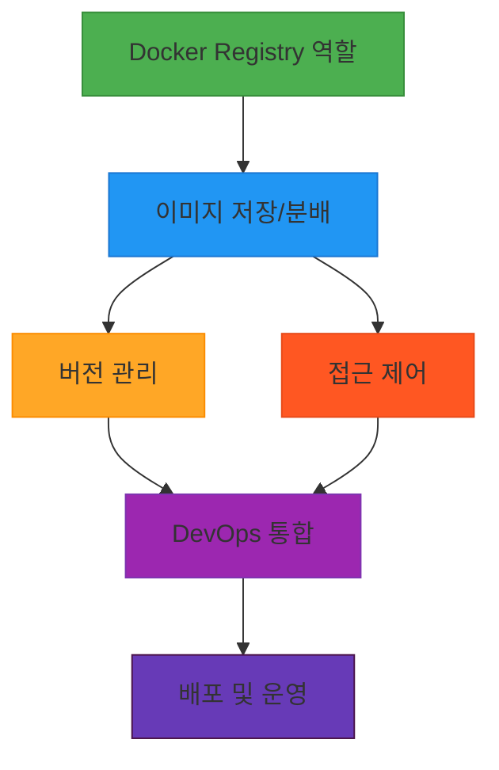
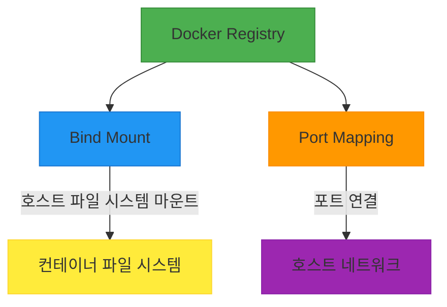

# 서비스 이해 (Service Understanding)

## 1. 배경 정보

배경 정보 보기

Docker Registry는 Docker 이미지를 저장하고 분배하는 핵심 서비스로, 개발자와 운영자가 컨테이너 이미지를 공유하고 관리하는 데 사용됩니다. 이미지 버전 관리, 접근 제어, 네트워크 통신 등을 지원하며, 컨테이너화된 애플리케이션 배포 시 필수적인 역할을 합니다. 사용자는 컨테이너 이미지의 생성, 저장, 추출, 배포 등을 통해 DevOps 파이프라인에 통합할 수 있습니다.

### 인포그래픽

**참고 이미지**:
- [이미지 보기](https://docs.docker.com/registry/introduction/)
- [이미지 보기](https://docs.docker.com/engine/reference/commandline/docker/)
- [이미지 보기](https://docs.docker.com/compose/reference/build/)

## 2. 핵심 개념

핵심 개념 보기

- Docker Registry: 컨테이너 이미지를 저장하고 관리하는 저장소
- Bind Mount: 호스트 파일 시스템을 컨테이너 내부로 마운트하는 기능
- Port Mapping: 호스트와 컨테이너 간 네트워크 포트 연결

### 인포그래픽

## 3. 장단점

장단점 보기

**장점**:
-  centralized 이미지 저장소로 팀 내 공유 및 관리 효율성 향상
- 버전 관리 및 롤백 기능으로 배포 안정성 확보
- HTTPS 및 인증 기능으로 보안성 강화

**단점**:
- 대규모 이미지 저장소 시 네트워크 대역폭 및 스토리지 요구 사양 증가
- 외부 네트워크 의존성이 높아 내부 네트워크 환경에서 제한적

## 4. 자주 사용되는 사례

사용 사례 보기

1. 기업 내부 이미지 레지스터로 사내 도커 이미지 공유
2. 오픈소스 이미지 공유를 위한 Docker Hub 연동
3. CI/CD 파이프라인에서 자동 빌드 이미지 저장 및 배포

## 5. 연관 서비스

연관 서비스 보기

- Docker Engine
- Docker Hub
- Kubernetes

## 6. 공식 문서 링크

- [Docker Registry 공식 문서](https://docs.docker.com/registry/)
- [Docker Registry GitHub 저장소](https://github.com/docker/distribution)

